## Linux로 살아보기

'Linux로 살아보기'라는 과제를 받았습니다.

Linux 운영체제를 설치하고, 그 위에서 직접 일주일에 한 개 이상씩의 프로그램들을 설치하고 실행시켜보면서 Linux라는 운영체제에 익숙해지는 것이 이 과제의 목표입니다.

### 첫 번째 선택

Linux를 설치하기 전, 첫번째로 선택해야하는 것은 'Linux를 메인 운영체제로 사용할 것이냐, 아니면 가상 머신을 통해 사용할 것이냐'입니다. 

저는 메인 운영체제로 macOS Catalina를 사용하고 있기 때문에 가상 머신을 통해 Linux를 사용하기로 했습니다.

### 두 번째 선택

가상 머신을 통해 Linux를 사용하기로 했으니, 어떤 가상머신을 통해 Linux를 설치할 것인지에 대해 생각을 해보아야 합니다.

고려할수 있는 가상머신은 총 3개 정도였습니다.

1. VirtualBox

2. VMware Fusion

3. Parallels Desktop

#### 1. VirtualBox

VirtualBox는 우선 공짜로 쓸 수 있다는 점에서 메리트가 있었지만, 사용할 수 있는 메모리와 프로세서 수, 그래픽메모리 용량 등에 제약이 많았습니다.

간단한 동작을 수행하는데에도 눈에 거슬릴 정도로 많이 버벅이며 느리다는 생각이 들었습니다.

#### 2. VMware Fusion

VMware Fusion은 Parallels Desktop과 macOS의 가상머신 양대산맥으로 손꼽히는 프로그램입니다.

하지만, 기능적인 측면에서 Parallels에 많이 밀린다는 느낌을 강하게 받았습니다.

#### 3. Parallels Desktop

Parallels Desktop이 VMware Fusion보다 [기능이 많고](https://www.parallels.com/kr/landingpage/pd/fusion-compete/?gclid=Cj0KCQjw6_vzBRCIARIsAOs54z53ur3lxesgA0yBwiU8TOixP3TGoXNmc93yYwbI02PlTeSQX17rmfwaAnRsEALw_wcB) Parallels Tools를 이용한 다양한 기능들도 사용할 수 있었습니다.

무엇보다도 이 혜택이 가장 큰 메리트가 아닐까 싶습니다.

결과적으로 Parallels Desktop을 통해 Linux 설치를 진행하게 되었습니다.

### 세 번째 선택

이제는 어떤 종류의 Linux를 사용할지를 선택할 시간입니다.

사실 이 선택이 가장 쉬웠습니다. 고려 대상은 다음과 같았습니다. 

1. 관련 Document가 많으며 정보를 쉽게 찾을 수 있는가?

2. 설치 및 설정, 유지/보수가 간편한가?

새로운 기술을 습득하고 학습함에 있어 매우 중요하다는 사실을 느낀 경험이 많기 때문에 널리 사용되며 커뮤니티도 많이 활성화된 Ubuntu를 사용하기로 결정했습니다.

## 설치

우선 다음과 같이 Parallels에서 Ubuntu를 바로 설치할 수도 있지만, 저는 iso 파일을 통해 따로 설치하겠습니다.

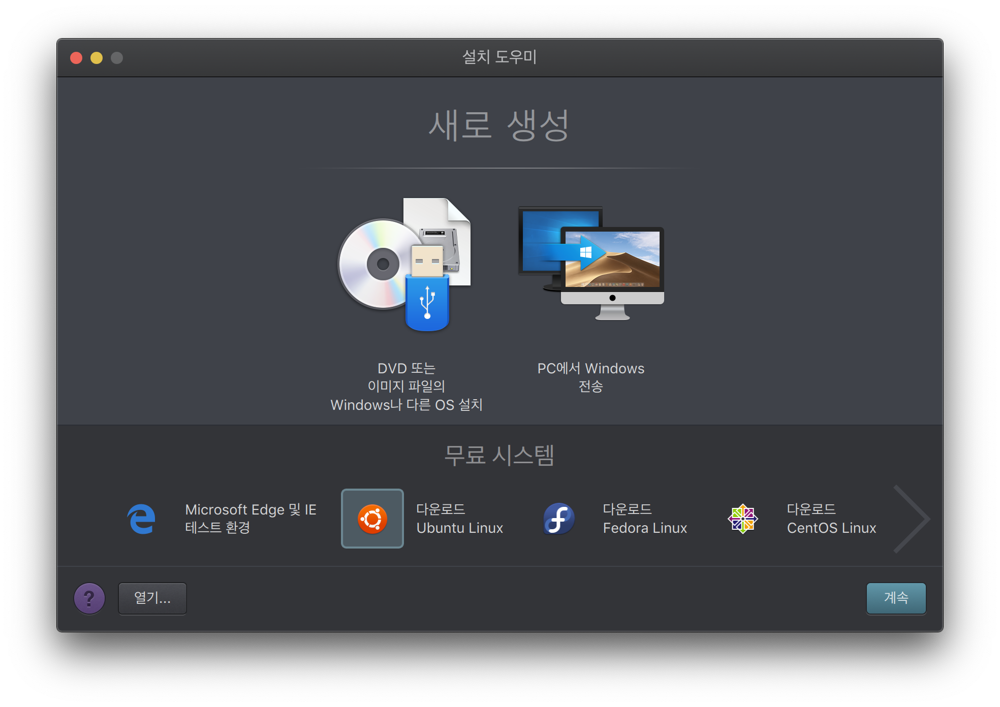

[이 링크](https://ubuntu.com/download/desktop)를 통해 Ubuntu iso 파일을 내려받을 수 있습니다.

링크로 들어가면 다음과 같은 화면이 나오는데, 저는 LTS 버전(Long-Term Service)을 설치해주도록 하겠습니다.

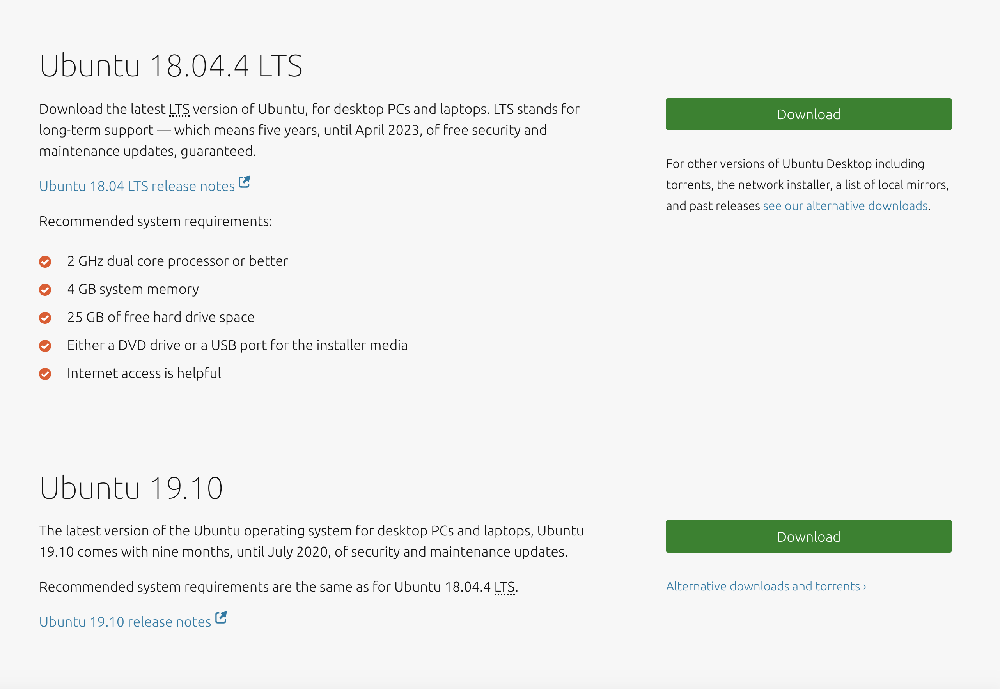

제가 설치하는 날짜 기준 Ubuntu 18.04.4 LTS 버전이 배포되고 있으며, 배포 시작일로부터 5년(2023년 4월까지) 서비스를 해준다고 명시되어 있습니다.

설치가 완료되면, Parallels에서 'DVD 또는 이미지 파일의 Windows나 다른 OS 설치'항목을 선택하여 설명대로 설치를 진행합니다.

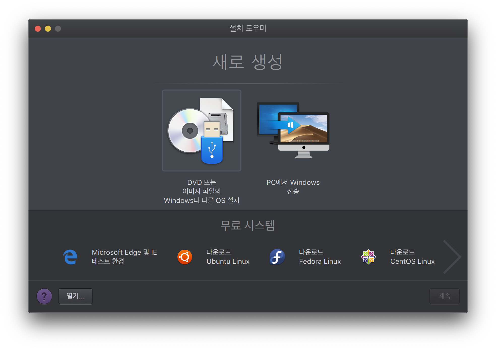

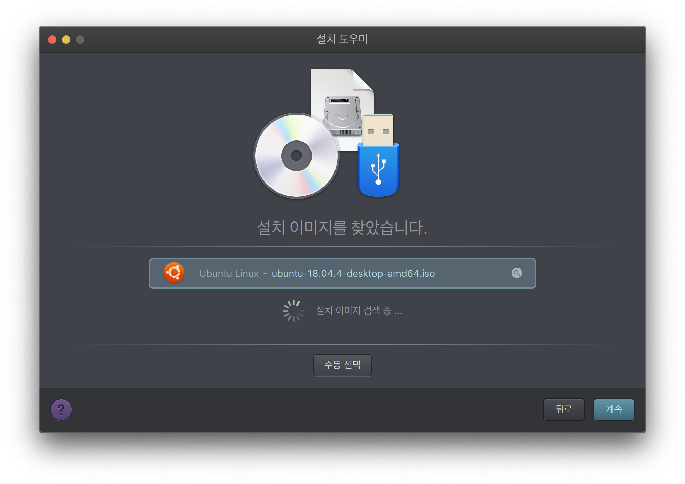

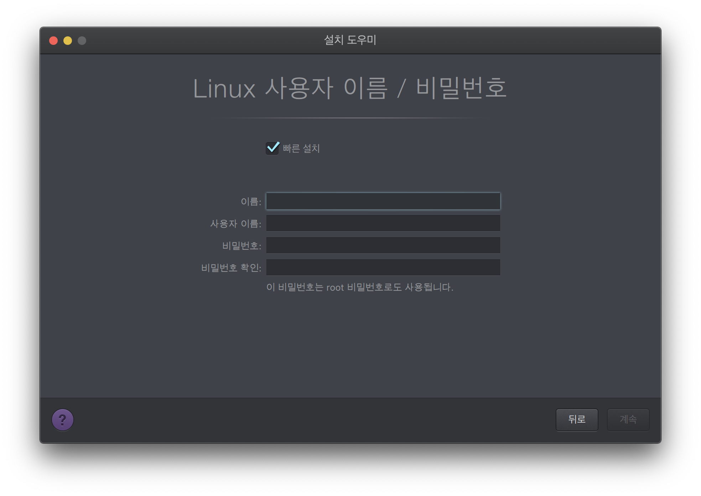

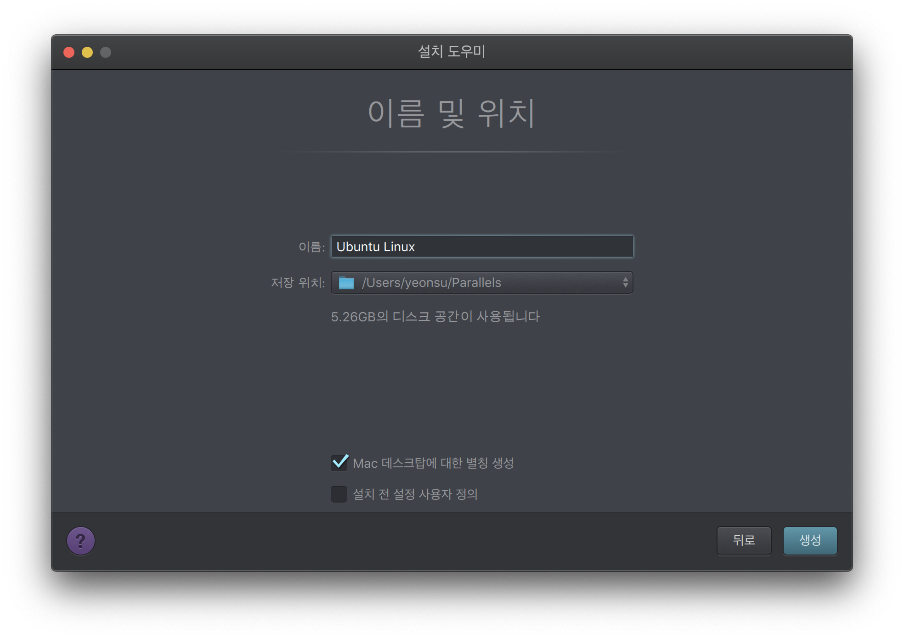

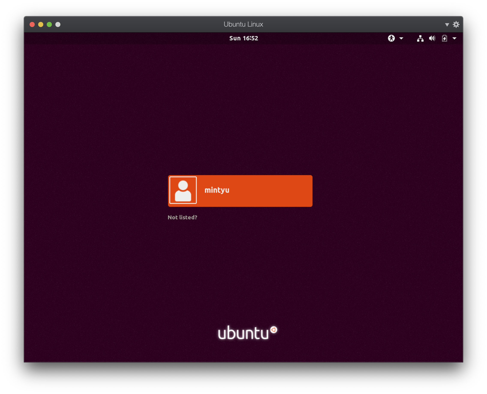

설치가 완료되었습니다! 그럼 기본 설정을 마저 해보도록 합시다.

## 설정

Ubuntu의 전원을 종료한 뒤, Parallels 우클릭 후 제어 센터를 선택하면 다음과 같은 창이 나옵니다.

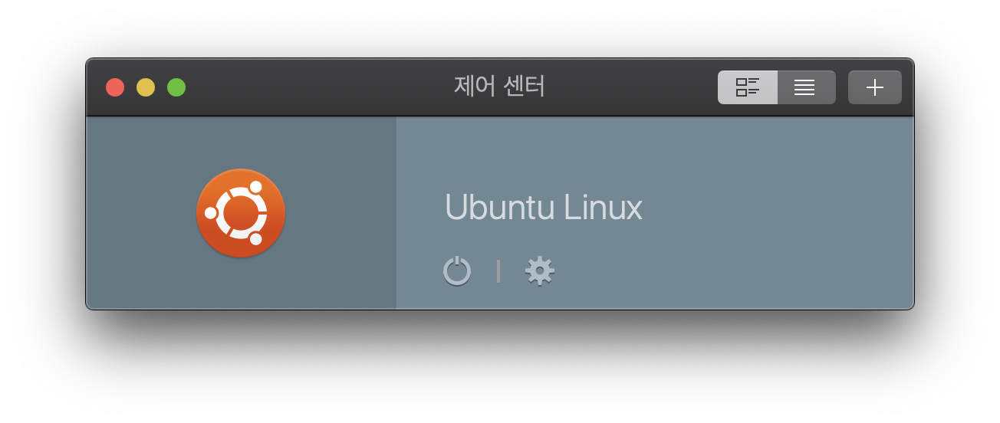

여기서 톱니바퀴 모양을 눌러 설정을 해줍시다!

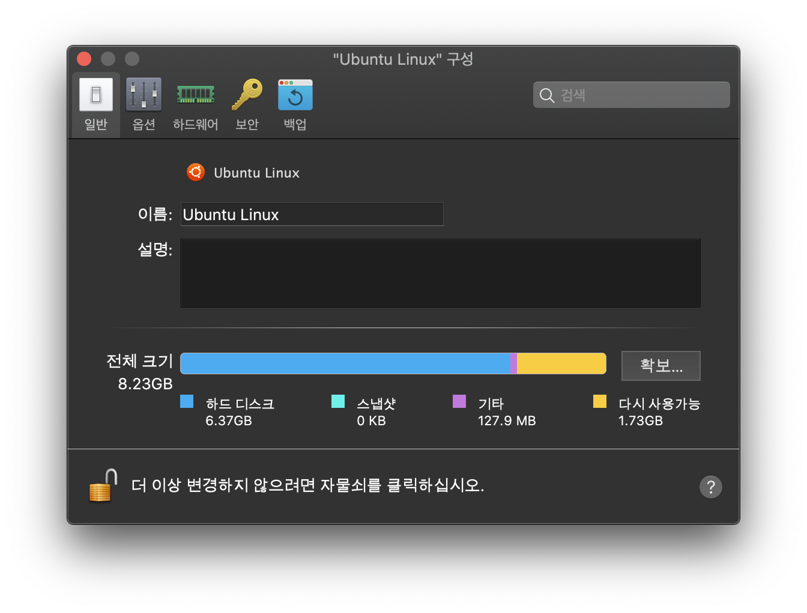

여기에서 가상 머신의 CPU 및 메모리, 그래픽 등을 설정해줄 수 있습니다.

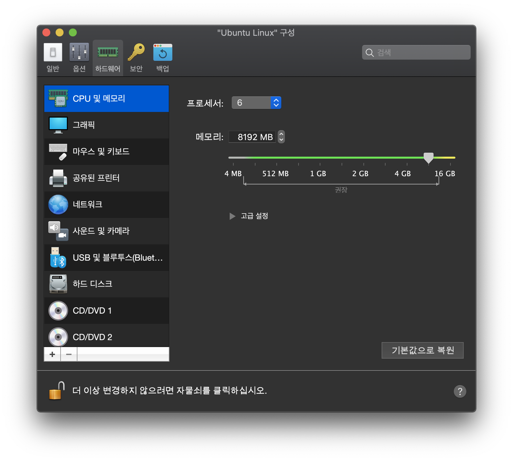

하드웨어 - CPU 및 메모리 탭에서는 프로세서 수와 메모리를 설정해줄 수 있습니다.

저는 총 12개의 프로세서 중 6개, 16GB의 메모리 중 8GB를 사용하기로 했습니다.

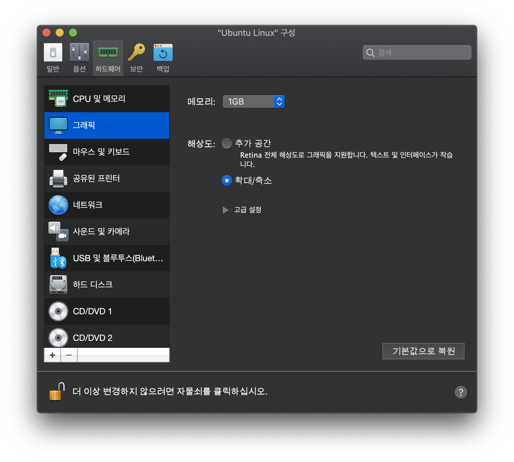

하드웨어 - 그래픽 탭에서는 그래픽 메모리 값을 설정해줍니다. 

저는 최대 2GB중 1GB를 사용하기로 했습니다.

위와 같이 설정을 마치고 나면, 보다 쾌적한 환경에서 Ubuntu를 실행할 수 있게 됩니다.

## 느낀점

무엇보다도, 설치를 하는 과정에서 Linux 운영체제가 그리 어렵지만은 않다는 생각이 들었다는 것이 가장 충격이었습니다.

엄청 복잡하고 처음 시작하는 사람은 접근하기가 어렵다는 선입견을 가지고 있었는데, Ubuntu는 그 고정관념을 깨기에 충분했던 것 같습니다.

다음 포스트부터는 한 주에 하나씩 Ubuntu에서 프로그램을 하나씩 설치하고 사용해가며 적응해야 할 텐데,

그 과정이 생각보다 어렵고 힘들지만은 않을 것 같다는 희망이 생긴 것 같습니다.

