## 2주차 Linux(Ubuntu)로 살아보기

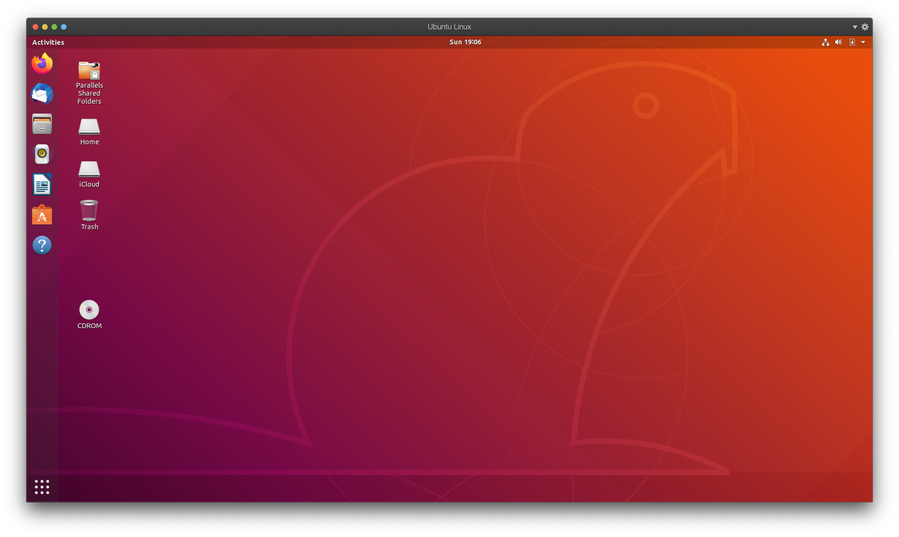

18.04버전의 화면 모습입니다. 알아보니 원래 Ubuntu는 'GNOME'이라는 데스크탑 환경을 채택했다가, 'Unity'환경으로 바꾸었었고, 이제 다시 18.04버전부터 'Unity'와 상당히 유사하게 디자인 된 테마를 달고 나온 'GNOME'이 다시 기본 데스크탑 환경으로 채택되었다고 합니다.

기대했던 것보다 훨씬 깔끔하게 디자인되어 있는 것 같아서 나쁘지 않다는 생각을 했습니다. 하지만, 몇몇 프로그램을 시작해보면서 불편함을 느끼기 시작했습니다.

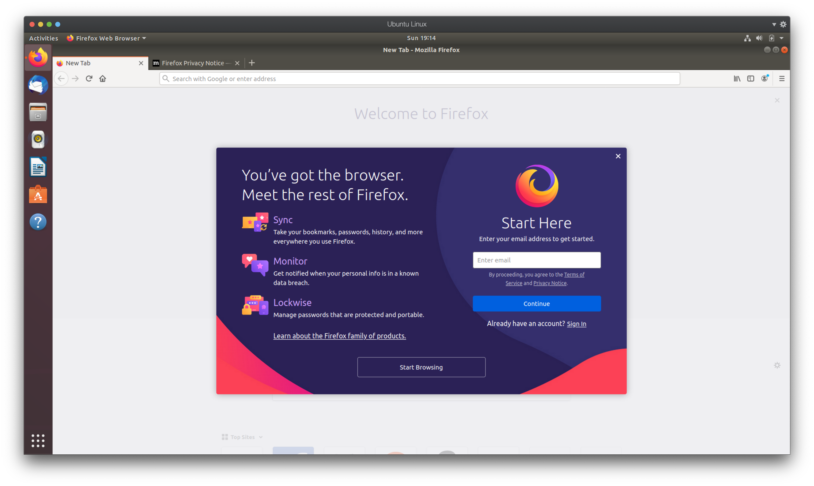

Ubuntu를 설치하고 가장 먼저 실행해본 것은 Firefox!

뭔가 벌써 불편함이 느껴지지는 않으신가요?

아마 불편함을 느꼈다면 저와 같은 생각이실겁니다.

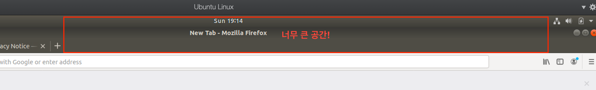

안그래도 좌측의 런처(Launcher)때문에 작업 화면이 손해를 보고 있는데, 상단바 때문에 상당히 큰 공간이 낭비되고 있다는게 보이시나요?

심지어 메뉴바도 활성화되지 않은 상태입니다. 만약 메뉴바가 활성화되어있었다면 더 큰 공간을 차지하게 되는 것이죠.

인터넷을 뒤져보니 이런 불편함을 호소하는 사람들은 저뿐만이 아니었고, 해결 방법을 어렵지 않게 찾을 수 있었습니다.

### 1. Top Bar 제거하기 - Unite

우선 [https://addons.mozilla.org/ko/firefox/addon/gnome-shell-integration/](https://addons.mozilla.org/ko/firefox/addon/gnome-shell-integration/)에 들어가서 Add-On을 설치해줍니다.

그 후, 바탕화면에서 우클릭 후 'Open Terminal'로 Terminal을 엽니다

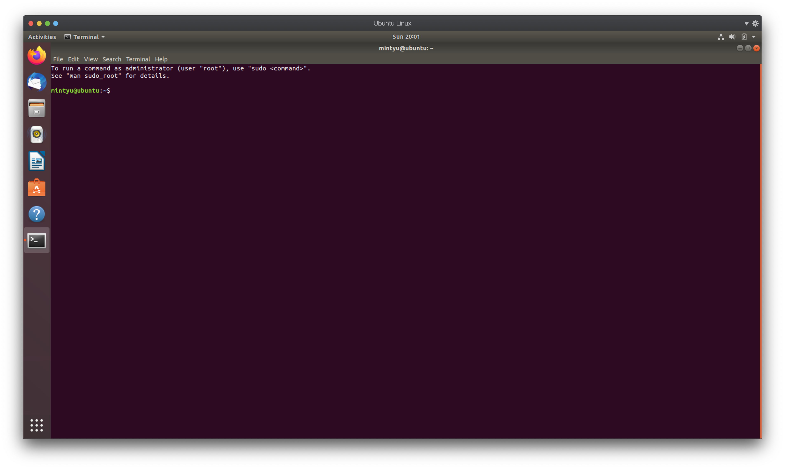

위와 같이 Terminal이 열렸다면 다음처럼 입력해줍니다.

```
$ sudo apt-get install chrome-gnome-shell
```

이제 Unite를 설치해주어야 하는데, Unite는 패키지 의존성이 있기 때문에 터미널에 다음과 같이 입력해서 패키지를 먼저 설치해줍니다.

```
$ sudo apt install x11-utils gnome-shell-extension-dashtodock
```

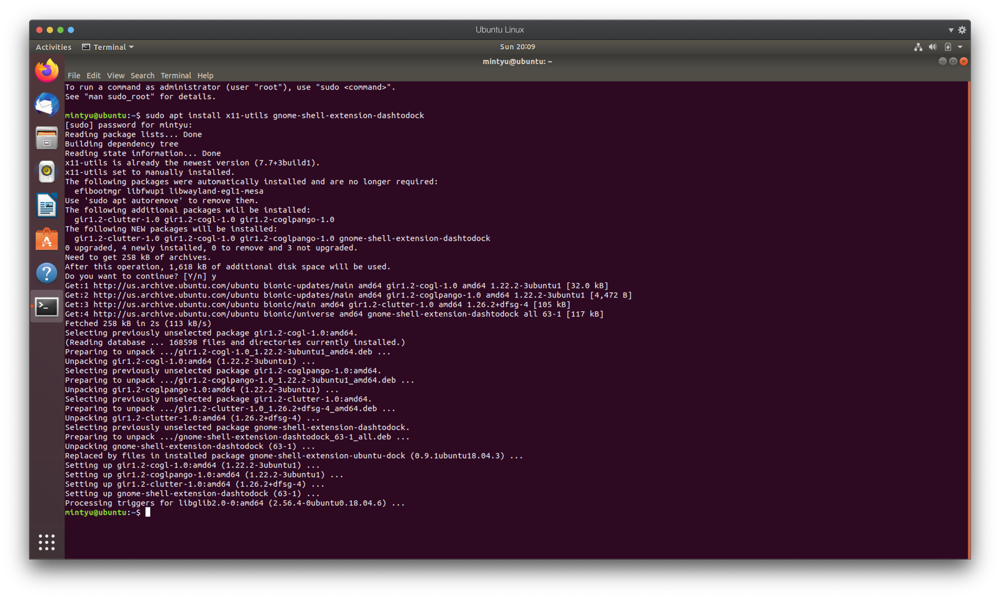

이제 Unite plugin을 설치해줄 차례입니다!

[https://extensions.gnome.org/](https://extensions.gnome.org/)

위 링크에 접속해줍니다. 그 후, Unite를 검색해서 설치해주면 됩니다.

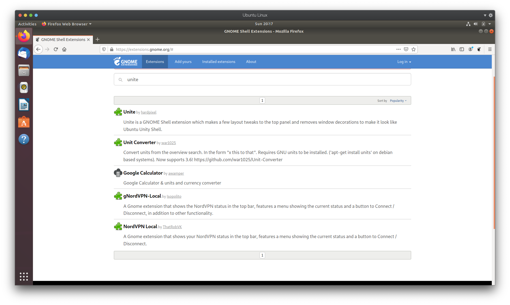

Unite를 눌러 들어가준 뒤, 아래 사진의 표시한 부분을 클릭하여 On으로 만들어줍니다.

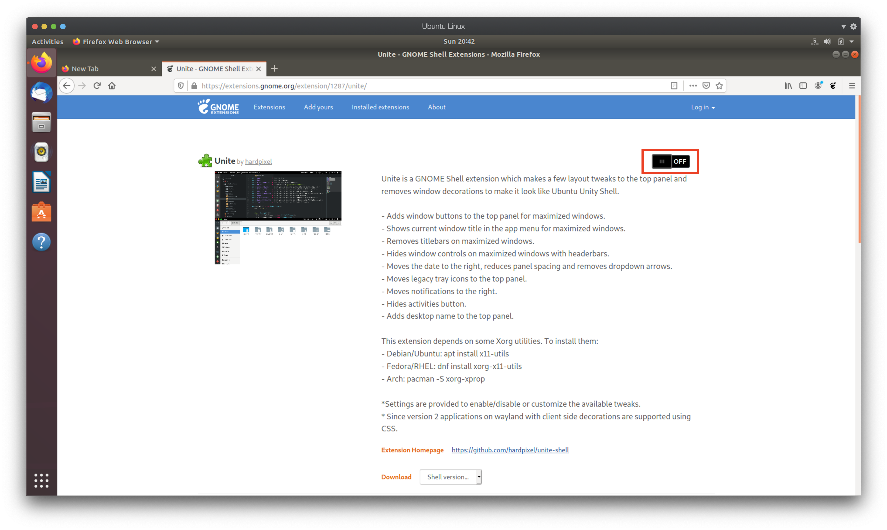

설치할 것이냐고 묻는 팝업창이 뜨고, 여기서 Install을 선택하게 되면,

다음과 같이 Top Bar와 Title Bar, Menu Bar가 공간을 같이 사용하면서 차지하는 공간이 줄어들게 됩니다.

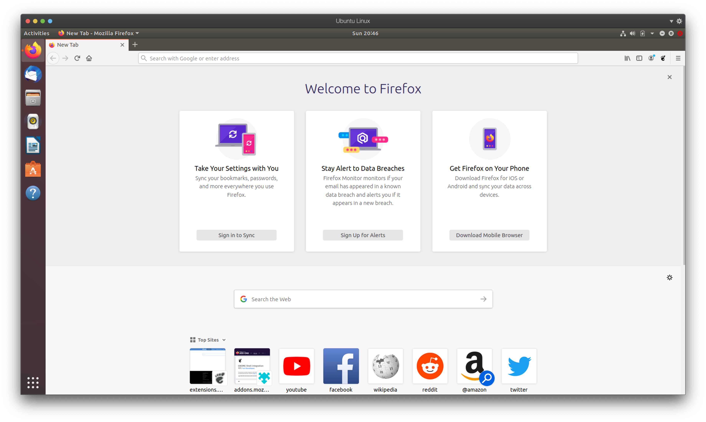

어떤 차이인지 비교해볼까요?

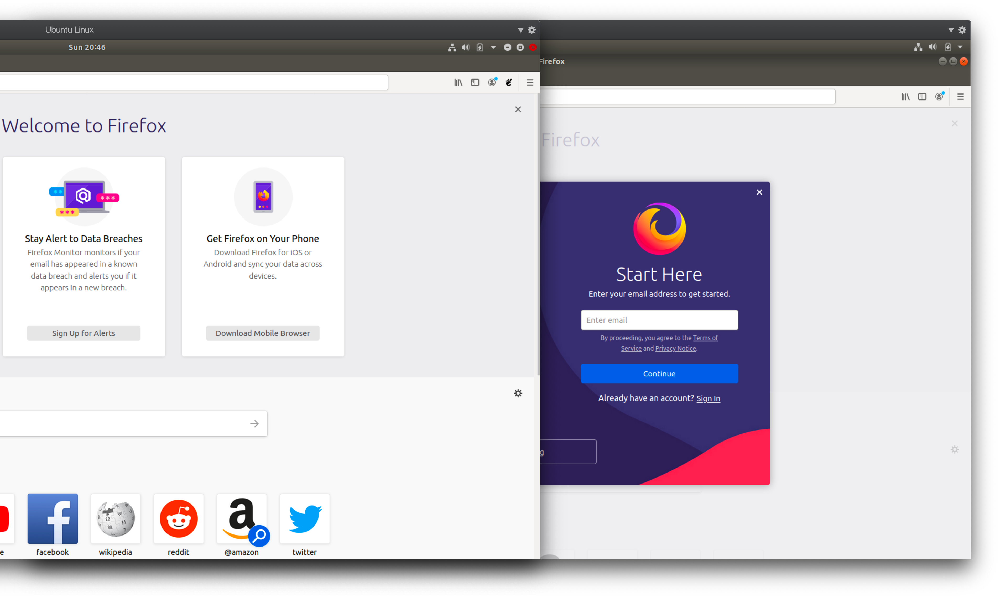

왼쪽에 있는 창이 Unite를 설치한 후의 모습이고, 오른쪽에 있는 창이 Unite를 설치하기 전의 모습입니다.

실질적으로는 Title Bar 크기 만큼의 공간이 확보가 된 것인데, 이정도 크기 확보로도 전보다는 훨씬 시원시원한 느낌이 드는 것 같습니다.

### 2. SleepMode 방지 - Caffeine

Ubuntu를 사용하다 보니, Ubuntu를 실행시키고 이것저것 검색하거나 글을 쓰다 들어오면,

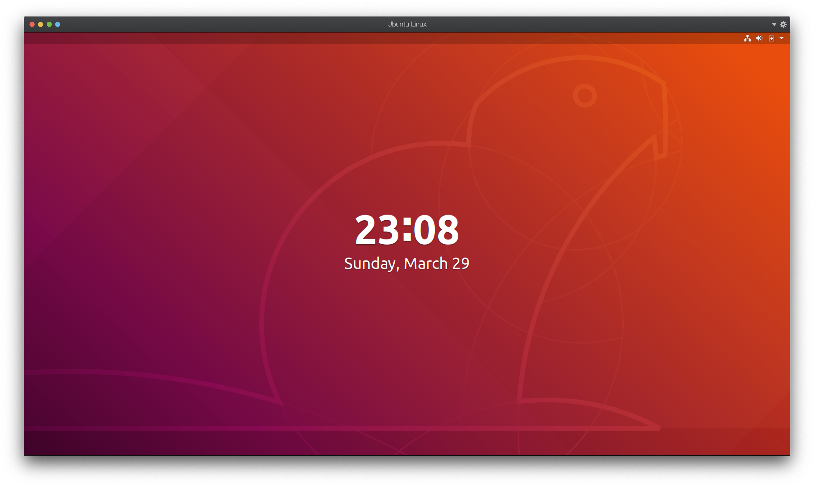

어느 순간 이렇게 위처럼 SleepMode가 되어 잠겨버리고 다시 로그인해야하는 상황이 종종 있었습니다.

이게 또 생각보다 거슬릴 때가 많아서 방법을 모색하던 중, extension 설치를 통해 해결할 수 있다는 사실을 알았습니다.

그 extension의 이름이 바로 Caffeine입니다. 

Ubuntu를 잠들지 못하게 하겠다는 의지가 담긴 이름같습니다. ~~정말 이름한번 잘 지은 것 같습니다.~~

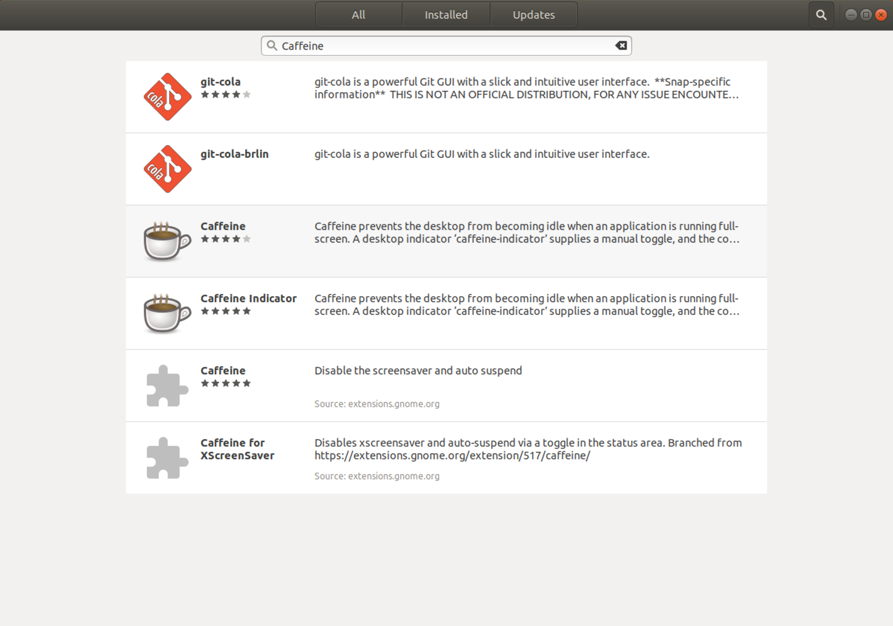

Ubuntu Software에서 우측 상단의 검색 버튼을 눌러 'Caffeine'을 검색한 후, 설치를 진행합니다.


설치가 완료된후, Caffeine을 실행시키게 되면 우측 상단에 컵 모양 아이콘이 생기게 됩니다.

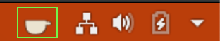

이 아이콘을 클릭한 후 'Activate'를 선택하게 되면,

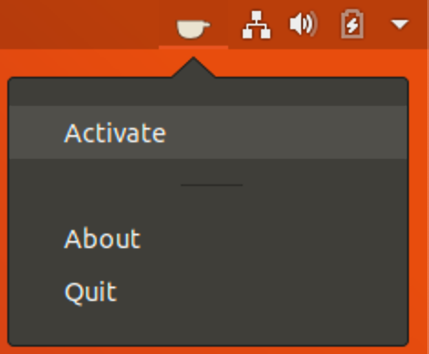

다음과 같이 컵에서 김이 올라오며 실행된 것을 볼 수 있습니다.

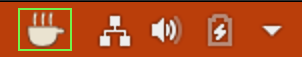

이렇게 실행해 두면 Ubuntu를 가만히 두더라도 SleepMode가 실행되지 않는 것을 확인했습니다

더 이상 귀찮게 암호를 다시 입력해서 잠금을 해제해야하는 일이 생기지 않겠네요ㅎㅎ

## 느낀 점

Ubuntu를 사용해보면서, 정말 많은 사람들이 함께 만들어가고 있다는 느낌을 받았습니다.

무언가 사용하다 불편한 점이 있다고 한다면 인터넷 서칭을 하다보면 비슷한 불편함을 겪었던 사람들을 찾을 수 있고, 해결책 또한 쉽게 찾을 수 있다는 것이 정말 마음에 들었습니다.

누군가 불편함을 느끼면 그것을 해결하기 위해 다함께 노력하고, 공유하는 그 시스템을 보고, 몸소 느끼면서 Linux의 매력을 알 수 있었던 한주였습니다.

'Firefox 브라우저 디자인이 보기 안좋다! 이렇게 수정했으면 좋겠다'라는 의견이 있으면 그 문제를 해결하는 방법을 찾아내고 서로 공유했기에 제가 이렇게 쉽고 빠르게 해결 방안을 찾고 문제를 해결할 수 있었고,

마찬가지로 'Ubuntu가 SleepMode에 들어가지 않았으면 좋겠다!'라는 의견이 있으면 그 문제를 해결하는 소프트웨어를 만들어내고 공유해서 많은 사람들이 쓸 수 있도록 했기 때문에 저는 간단하게 그 소프트웨어를 내려받음으로써 불편함을 해소할 수 있었습니다.

이렇게 잘 구축된 운영체제와 커뮤니티가 서로 맞물려 상호작용하면서 긍정적인 작용을 하고있는 것을 느낄 수 있었습니다.

Linux의 어찌보면 가장 두드러지는 특징이라고 할 수 있는 '오픈소스 소프트웨어'를 직접 체험해보고 몸소 장점을 느껴봤다는 점에서 의미있는 시간이었다고 생각합니다.

---
이번주는 Ubuntu를 사용하면서 불편한 점을 해소하는 방법을 알아봤다면,

다음주부터는 간단한 코딩을 Ubuntu를 통해 해보거나 다른 응용프로그램들을 설치해서 직접 사용해보는 활동들을 주로 해보도록 하겠습니다.