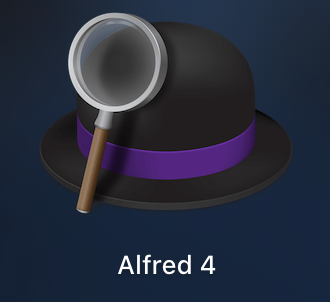
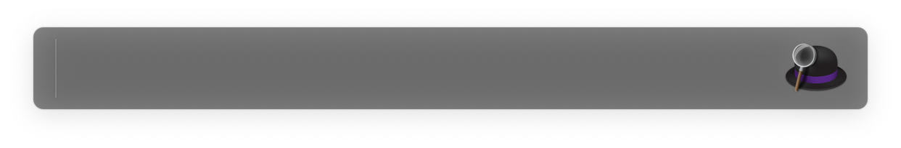
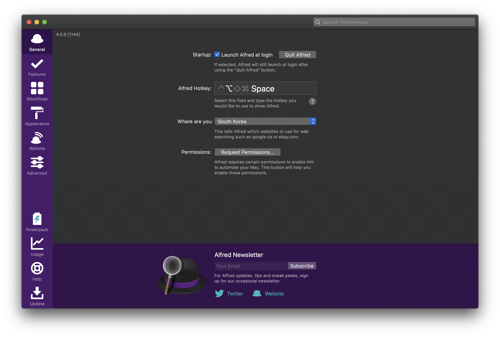
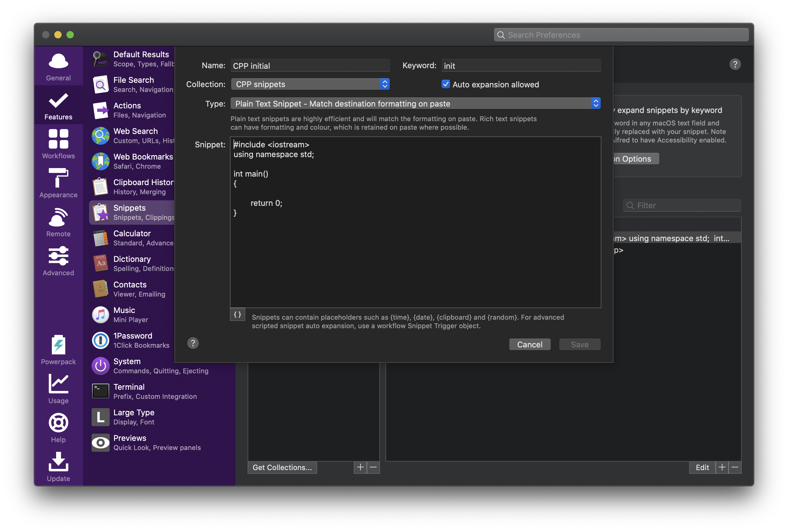

## Alfred

오늘 소개할 어플은 Alfred입니다.



원래 Paste2를 사용하고 있었는데, 갑자기 구독형으로 정책을 바꾸는바람에 대체 앱을 서칭하다 발견했습니다.

(~~비싸긴 하지만~~)Paste2보다 훨씬 기능도 강력하고, 무엇보다도 'Snippet'기능이 마음에 쏙 들었습니다.

기능을 좀 살펴본 후 아무 고민도 없이 갈아탔습니다!

Alfred의 Default 단축키는 `⌥ + Space`로 설정되어있습니다.



눌러보면, 기존 맥의 Spotlight 검색 기능과 매우 비슷한 검색창이 나옵니다.

여기에 `alfred`를 검색하고 엔터를 누르면 다음과 같은 preference창을 볼 수 있습니다.



저는 우선 Appearance부터 설정해줬습니다. 앞서 설명했던 Search Bar의 테마를 설정할 수 있습니다.

기본제공되는 테마를 쓰려 했지만 별로 마음에 드는게 없어서 테마를 따로 만들었습니다.


테마를 만드는 과정이 굉장히 쉽고 간단하기 때문에 마음에 들지 않는다면 본인의 입맛에 맞는 테마를 만들어 쓰면 됩니다.

이제 Snippet 기능을 본격적으로 사용해봅시다!

### Snippets


Features 탭에서 Snippets라는 기능을 설정해 줄 수 있습니다.

흔히 말하는 자동 완성 기능이라고 생각하면 쉽습니다.


설정 창은 위와 같이 생겼으며, 우측 상단의 "Automatically expand snippets by keyword"를 체크하게 되면 따로 동작을 추가로 입력하지 않아도 자동으로 keyword를 인식하고 자동으로 입력해줍니다.

예시로 몇 개를 만들어두었는데, 사용법은 굉장히 간단합니다.

좌측은 Collection입니다. 같은 기능을 하는 Snippet들을 묶어서 정리할 수 있으며, 공통된 prefix를 지정해줄 수 있습니다.

저는 C++ 관련 Snippet의 prefix를 `#`으로 설정해 두었습니다.

이 Snippet들 중 CPP initial이라는 항목은 어떻게 설정되어있는지 보도록 하겠습니다.



name에는 그 Snippet의 기능을 설명해주는 이름이면 충분하고, keyword는 Collection에서 지정해주었던 prifix와 함께 쓰여서 동작하게되므로 본인이 편한 약어를 지정해주면 됩니다.

예를 들어, CPP initial이라는 이름의 Snippet은 Collection의 prifix가 `#`이고 keyword가 `init`이므로, `#init`을 입력하게 되면 다음과 같이 설정해둔 내용으로 바로 변환되어 입력됩니다.

``` cpp
#include <iostream>
using namespace std;

int main()
{
	
	return 0;
}
```

이를 통해 반복적인 작업을 최대한 줄여줄 수 있습니다.

Snippet 설정창의 왼쪽 아래부분 Curly bracket(`{ }`)을 통해 Placeholder를 설정해줄 수도 있습니다.

Placeholder를 통해 출력할 수 있는 기능은 아래와 같습니다.

1. 오늘 날짜 출력
2. 다른 날짜 출력
3. 클립보드 히스토리
4. 랜덤 출력
5. Snippet 실행 후 최종 커서 위치 설청

이를 이용하면 그 때마다 상황에 맞는 데이터를 출력해줄 수 있습니다.

Placeholder의 사용법에 대한 더 자세한 설명은 다음 링크에서 확인할 수 있습니다.

[https://www.alfredapp.com/help/workflows/advanced/placeholders/](https://www.alfredapp.com/help/workflows/advanced/placeholders/)