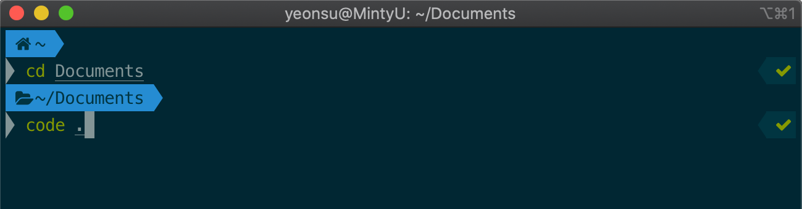
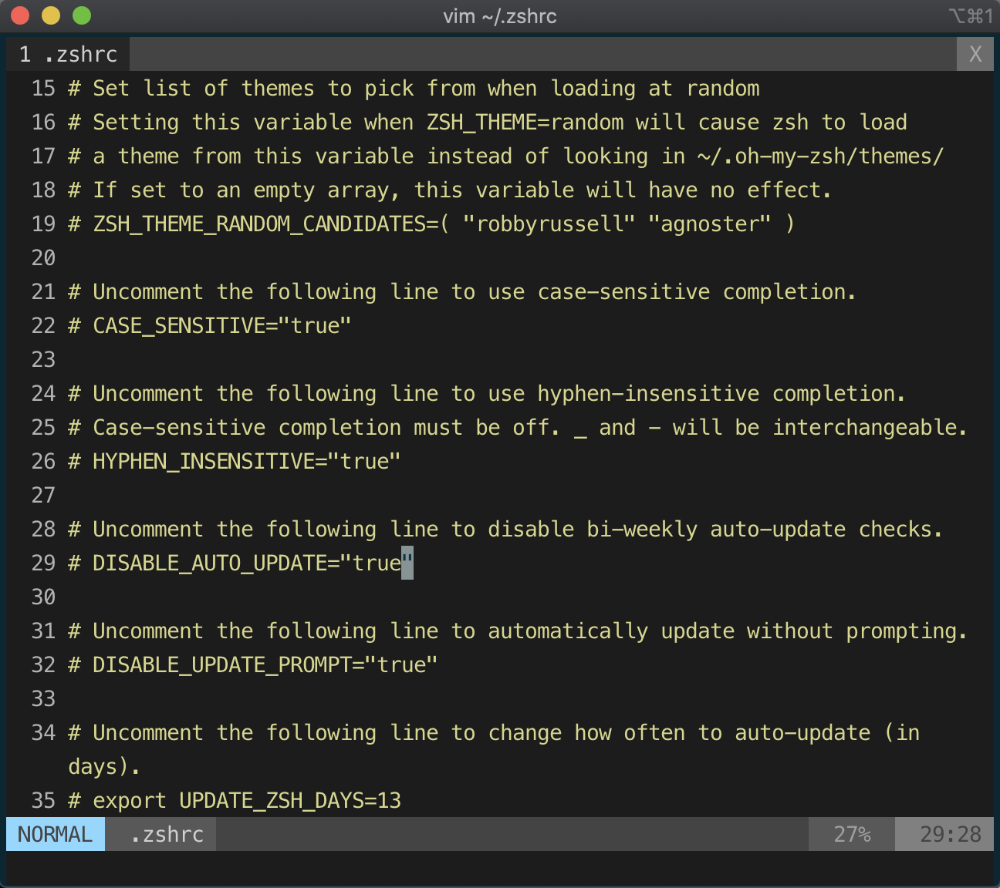
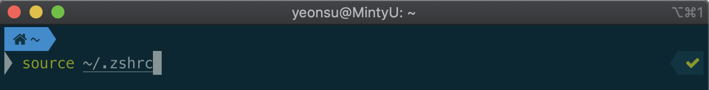

MAC OS를 사용하는 경우, iTerm에서 VSCode를 간단한 명령어로 호출할 수 있습니다.

다음과 같이 열고자 하는 디렉토리 내에서 `code .`라는 명령어를 입력해주면 현재 경로로 VSCode가 실행됩니다.



## Setting

하지만, 이를 위해선 간단한 세팅을 해 주어야 합니다.

먼저, 현재 저는 iTerm2 Terminal에 oh-my-zsh를 사용하고 있음을 밝힙니다.

저처럼 iTerm2에 oh-my-zsh 세팅까지 모두 끝냈다면 ~/.zshrc를 편집하는 방법은 알고 있겠지만, 모른다 하더라도 어렵지는 않습니다.

iTerm2 터미널을 열고, 다음과 같이 입력합니다.

```
$ vim ~/.zshrc
```

위 명령어를 입력했다면, 다음과 같은 화면을 볼 수 있습니다.



Shift + g를 눌러 문서의 맨 아래로 이동한 후, o(아랫줄에 insert)를 눌러 편집모드를 켭니다.

그리고 다음과 같이 입력해줍니다.

```
code () {VSCODE_CWD="$PWD" open -n -b "com.microsoft.VSCode" --args $* ;}
```

입력이 되었다면, esc버튼을 눌러 편집 모드를 끝낸 뒤에(왼쪽 아래 normal 확인),

:wq를 입력하여 저장하고 나가줍니다.(":"을 누르면 명령어 입력창이 활성화됩니다.)

그 후 터미널에서 다음과 같이 `source ~/.zshrc`를 입력하면 터미널에서 명령어를 통해 VSCode를 실행할 수 있게 됩니다!

