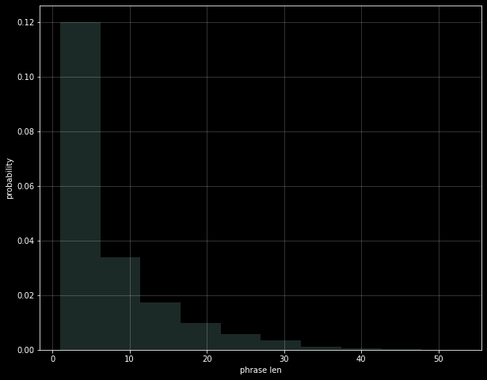
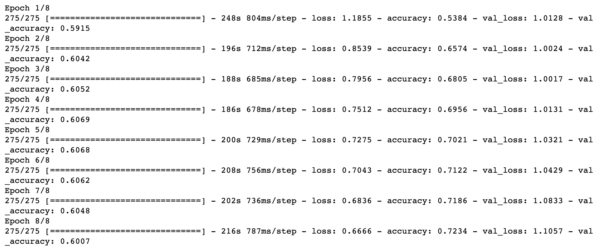
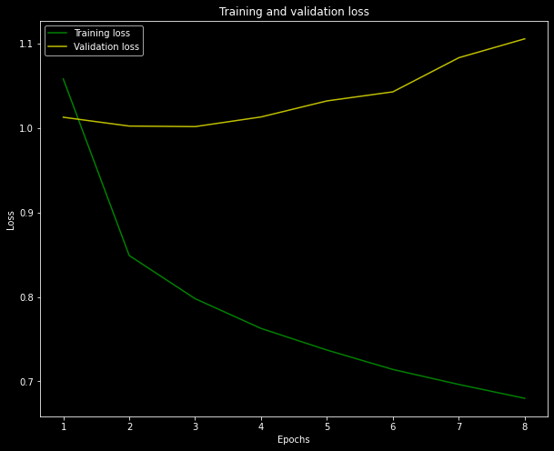
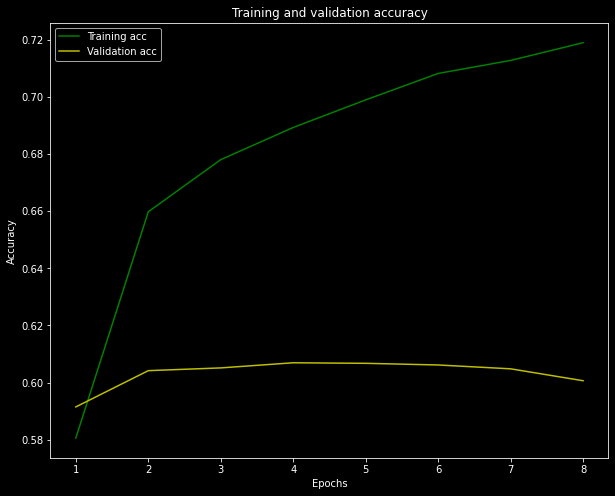

## LSTM(Long Short Term Memory) 실습

Kaggle의 영화 리뷰에 대한 감정 예측 데이터셋에 대해 LSTM으로 자연어차리 실습을 해보도록 하겠습니다.

[Kaggle 링크](https://www.kaggle.com/c/movie-review-sentiment-analysis-kernels-only/)를 통해 실습 데이터셋을 받을 수 있습니다.

Data 탭에서 `train.tsv.zip`, `test.tsv.zip` 을 내려받아 압축을 풀면 각각 train set과 test set의 tsv 파일을 얻을 수 있습니다.

해당 데이터셋에서 감정을 나타내는 label들의 의미는 다음과 같습니다.

- 0 : negative
- 1 : somewhat negative
- 2 : neutral
- 3 : somewhat positive
- 4 : positive

### 데이터 가져오기

우선 실습에 필요한 library들을 불러옵니다.

```python
import numpy as np
import pandas as pd
from matplotlib import pyplot as plt
plt.style.use('dark_background')
from keras.preprocessing.text import Tokenizer
from keras.preprocessing.sequence import pad_sequences
from sklearn.model_selection import train_test_split
from keras.utils.np_utils import to_categorical
from keras.models import Sequential
from keras.layers import Dense, Dropout, Embedding, LSTM, GlobalMaxPooling1D, SpatialDropout1D
```

`to_categorical`은 keras의 버전에 따라 
```python
from keras.utils.np_utils import to_categorical
```
혹은
```python
from keras.utils import to_categorical
```

둘 중 동작하는 것으로 진행하면 됩니다.

```python
df_train = pd.read_csv('train.tsv', sep='\t')
print('train set: {0}'.format(df_train.shape))
df_train.head(10)
```

우선 train 데이터셋을 불러왔습니다. tsv 파일이므로 `sep='\t'`옵션으로 데이터를 불러옵니다.


```python
df_test = pd.read_csv('test.tsv', sep='\t')
print('test set: {0}'.format(df_test.shape))
df_test.head(10)
```

마찬가지로, test 데이터셋도 불러와줍니다.

### 데이터 전처리

```python
replace_list = {r"i'm": 'i am',
                r"'re": ' are',
                r"let’s": 'let us',
                r"'s":  ' is',
                r"'ve": ' have',
                r"can't": 'can not',
                r"cannot": 'can not',
                r"shan’t": 'shall not',
                r"n't": ' not',
                r"'d": ' would',
                r"'ll": ' will',
                r"'scuse": 'excuse',
                ',': ' ,',
                '.': ' .',
                '!': ' !',
                '?': ' ?',
                '\s+': ' '}
def clean_text(text):
    text = text.lower()
    for s in replace_list:
        text = text.replace(s, replace_list[s])
    text = ' '.join(text.split())
    return text

```

원활한 학습을 위해 전처리를 진행해줍니다. `i'm` 과 `i am`은 같은 단어이지만 다르게 인식될 수 있으므로 형태를 통일해주고, 단어 뒤에 문장 부호가 붙어있는 경우에도 다른 단어로 인식되므로 빈 칸을 추가하여 단어와 문장 부호가 서로 다른 단어로 인식될 수 있게끔 전처리를 해줍니다. 또한, 대문자와 소문자의 차이도 제거하기 위해 모든 단어의 글자들을 `.lower()`함수를 통해 소문자로 만들어 줍니다.

아래 코드를 통해 적용해줍니다.

```python
X_train = df_train['Phrase'].apply(lambda p: clean_text(p))
```

<br/>
이제, corpus(말뭉치)에 있는 구문의 길이를 시각화해보겠습니다.

```python
phrase_len = X_train.apply(lambda p: len(p.split(' ')))
max_phrase_len = phrase_len.max()
print('max phrase len: {0}'.format(max_phrase_len))
plt.figure(figsize = (10, 8))
plt.hist(phrase_len, alpha = 0.2, density = True)
plt.xlabel('phrase len')
plt.ylabel('probability')
plt.grid(alpha = 0.25)
```
```
max phrase len: 53
```


가장 긴 문장의 길이는 53이며, 단어 길이의 분포는 위와 같습니다.

신경망에 대한 모든 입력은 길이가 같아야합니다. 따라서 가장 긴 길이를 나중에 모델에 대한 입력을 정의하는 데 사용할 변수로 저장합니다.

```
y_train = df_train['Sentiment']
```

감정 데이터가 있는 `Sentiment` 항목으로 train set을 만들어줍니다.

이제 `tokenizer`를 통해 토큰화를 진행합니다. 
또한, `filters=` 옵션을 통해 특수문자들을 제거해줍니다.

```
max_words = 8192
tokenizer = Tokenizer(
    num_words = max_words,
    filters = '"#$%&()*+-/:;<=>@[\]^_`{|}~'
)
tokenizer.fit_on_texts(X_train)
X_train = tokenizer.texts_to_sequences(X_train)
X_train = pad_sequences(X_train, maxlen = max_phrase_len)
y_train = to_categorical(y_train)
```

`to_categorical` 함수를 통해, `y_train` 값을 원-핫 벡터로 바꿔주어 인코딩 과정도 진행해줍니다.

### Training

```python
model_lstm = Sequential()
model_lstm.add(Embedding(input_dim = max_words, output_dim = 256, input_length = max_phrase_len))
model_lstm.add(SpatialDropout1D(0.3))
model_lstm.add(LSTM(256, dropout = 0.3, recurrent_dropout = 0.3))
model_lstm.add(Dense(256, activation = 'relu'))
model_lstm.add(Dropout(0.3))
model_lstm.add(Dense(5, activation = 'softmax'))
model_lstm.compile(
    loss='categorical_crossentropy',
    optimizer='Adam',
    metrics=['accuracy']
)
```
LSTM 레이어를 만들어 모델을 작성합니다.

```python
history = model_lstm.fit(
    X_train,
    y_train,
    validation_split = 0.1,
    epochs = 8,
    batch_size = 512
)
```
`epochs`는 8, `batch_size`는 512로 설정하고 10%만큼을 validation set으로 이용하게 됩니다.



train이 완료되었습니다. history에는 LSTM fitting 과정에서 각 epoch마다의 `loss`와 `accuracy` 데이터가 저장됩니다.

loss와 accuracy 데이터를 시각화하면 다음과 같습니다.

```python
plt.clf()
loss = history.history['loss']
val_loss = history.history['val_loss']
epochs = range(1, len(loss) + 1)
plt.figure(figsize=(10, 8))
plt.plot(epochs, loss, 'g', label='Training loss')
plt.plot(epochs, val_loss, 'y', label='Validation loss')
plt.title('Training and validation loss')
plt.xlabel('Epochs')
plt.ylabel('Loss')
plt.legend()
plt.show()
```



```python
plt.clf()
acc = history.history['accuracy']
val_acc = history.history['val_accuracy']
plt.figure(figsize=(10, 8))
plt.plot(epochs, acc, 'g', label='Training acc')
plt.plot(epochs, val_acc, 'y', label='Validation acc')
plt.title('Training and validation accuracy')
plt.xlabel('Epochs')
plt.ylabel('Accuracy')
plt.legend()
plt.show()
```



validation set에서는 약 60%의 정확도를 얻을 수 있었습니다. 아마 test set을 직접 검증하더라도 비슷한 결과를 얻을 것으로 예측됩니다.(해당 정확도는 작성일 2021/06/07 기준 Kaggle LeaderBoard 중하위권에 해당하는 성적입니다.)

원-핫 벡터를 통해 단어의 등장 빈도 만으로 해당 문장이 긍정적인 문장인지, 부정적인 문장인지 판단하는 것에는 한계가 있습니다.

예를 들어, "good"이라는 단어가 등장한다고 무조건 긍정적인 문장이 될 수는 없습니다. "That is not good."과 같은 문장은 부정적인 의미를 담고 있기 때문입니다.

따라서, 앞뒤 단어의 상호 관계를 파악하여 의미를 유추할 수 있다면, 더 정확하게 예측이 가능할 것이라 생각합니다.