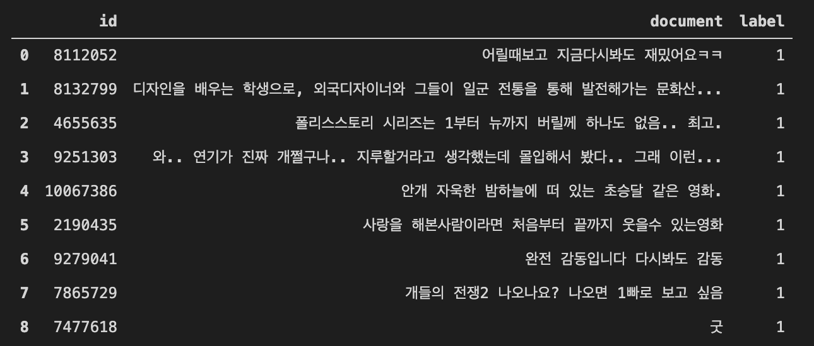
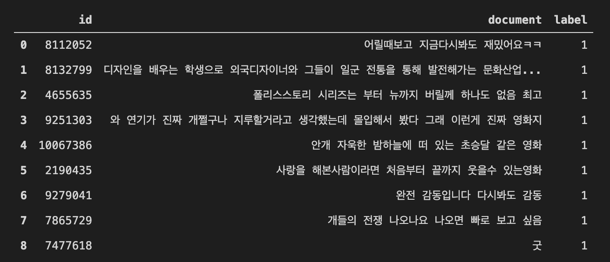
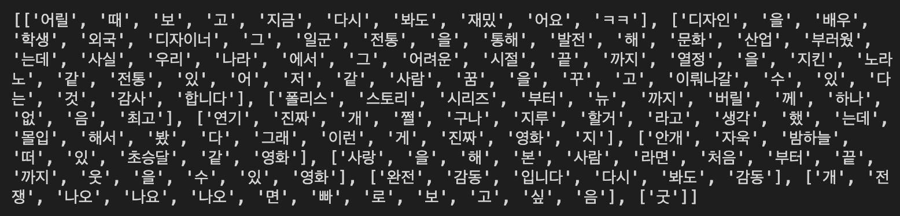

## 단어 집합(Vocabulary) 생성

단어 집합(vocabuary)이란 중복을 제거한 텍스트의 총 단어의 집합(set)을 의미합니다. 우선, 실습을 위해서 깃허브에서 '네이버 영화 리뷰 분류하기' 데이터를 다운로드하겠습니다. 네이버 영화 리뷰 데이터는 총 20만 개의 영화 리뷰를 긍정 1, 부정 0으로 레이블링한 데이터입니다.

```python
import urllib.request
import pandas as pd
from konlpy.tag import Mecab
from nltk import FreqDist
import numpy as np
import matplotlib.pyplot as plt

urllib.request.urlretrieve("https://raw.githubusercontent.com/e9t/nsmc/master/ratings.txt", filename="ratings.txt")
data = pd.read_table('ratings.txt') # 데이터프레임에 저장
data[:9]
```



```python
print('전체 샘플의 수 : {}'.format(len(data)))
# 전체 샘플의 수 : 200000
```

<br/>

```python
sample_data = data[:100] # 임의로 100개만 저장
```
<br/>

아래와 같이 정규 표현식을 통해 데이터를 정제하는 과정을 거칩니다.

```python
sample_data['document'] = sample_data['document'].str.replace("[^ㄱ-ㅎㅏ-ㅣ가-힣 ]","")
sample_data[:9]

```



그 다음은 토큰화를 수행하기에 앞서, 불용어(Stopword)를 제거하기 위해 불용어를 임의로 정해주었습니다.

불용어란, 자주 등장하지만 분석을 하는 것에 있어서는 큰 도움이 되지 않는 단어들을 말합니다.

```python
stopwords=['의', '가', '이', '은', '들', '는', '좀', '잘', '걍', '과', '도', '를', '으로', '자', '에', '와', '한', '하다']
```
<br/>

형태소 분석기는 Mecab을 사용합니다.

```python
tokenizer = Mecab()

tokenized=[]
for sentence in sample_data['document']:
    temp = tokenizer.morphs(sentence) # 토큰화
    temp = [word for word in temp if not word in stopwords] # 불용어 제거
    tokenized.append(temp)

print(tokenized[:9])
```


이제 단어집합(Vocabulary)을 생성합니다. NLTK에서는 빈도수 계산 도구인 FreqDist()를 지원합니다.

```python
vocab = FreqDist(np.hstack(tokenized))
print('단어 집합의 크기 : {}'.format(len(vocab)))
# 단어 집합의 크기 : 664
```

<br/>

`vocab`에는 단어를 키(key)로, 단어에 대한 빈도수가 값(value)으로 저장됩니다. 다음과 같이 vocab에 단어를 입력하면 등장한 빈도수를 리턴합니다.

```python
vocab['재밌']
# 10
```
<br/>

만약 vocab의 사이즈를 원하는대로 조정하고싶다면, `.most_common()`을 통해 할 수 있습니다. 예시는 다음과 같습니다.

```python
vocab_size = 100
vocab = vocab.most_common(vocab_size)
print('단어 집합의 크기 : {}'.format(len(vocab)))
# 단어 집합의 크기 : 100

```