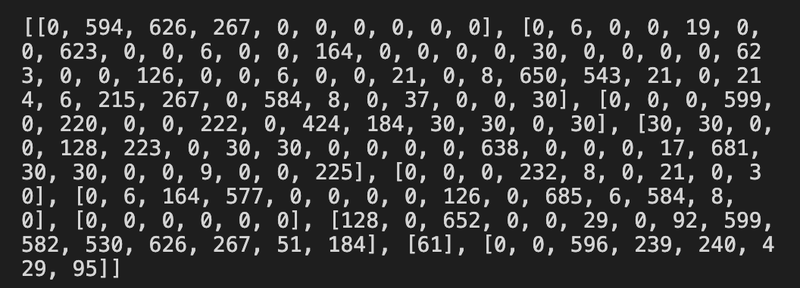
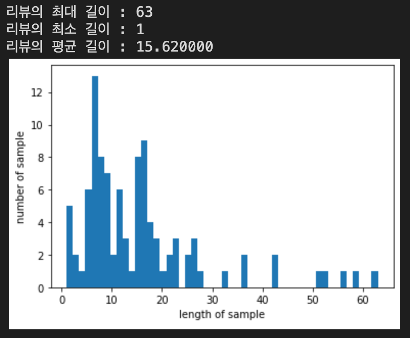
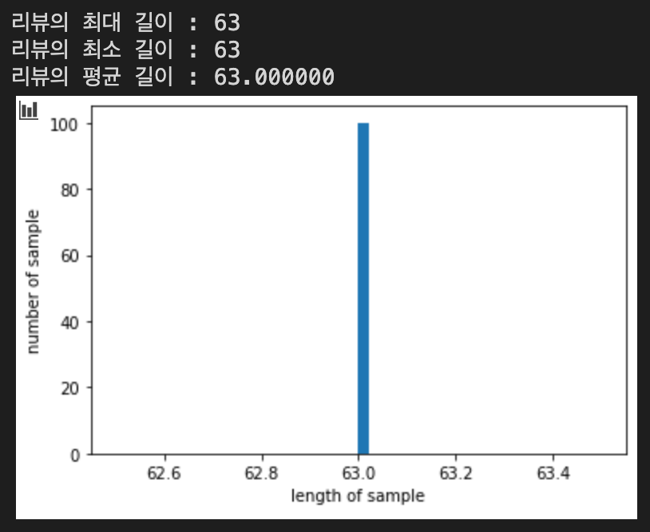
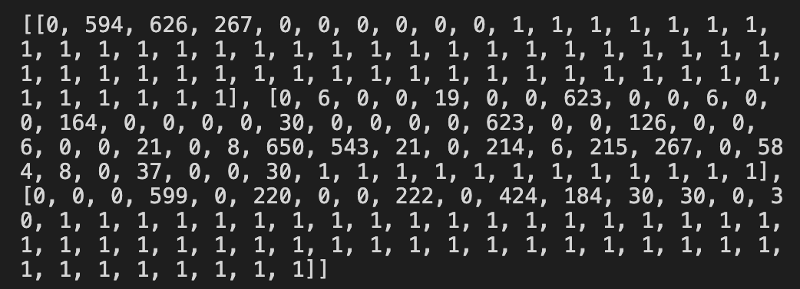

## 정수 인코딩

`enumerate()`는 순서가 있는 자료형(list, set, tuple, dictionary, string)을 입력으로 받아, 인덱스를 순차적으로 리턴해줍니다. 앞선 [Vocabulary](https://mintyu.github.io/Pytorch02/) 게시물에서 만든 단어 집합을 가져와서 정수로 바꿔줍니다.

인덱스 0과 1은 다른 용도로 사용하기 위해 남겨두고, 나머지 인덱스인 2부터 차례대로 부여합니다.

```python
word_to_index = {word[0] : index + 2 for index, word in enumerate(vocab)}
word_to_index['pad'] = 1
word_to_index['unk'] = 0
```

<br/>

```python
encoded = []
for line in tokenized: #입력 데이터에서 1줄씩 문장을 읽음
    temp = []
    for w in line: #각 줄에서 1개씩 글자를 읽음
      try:
        temp.append(word_to_index[w]) # 글자를 해당되는 정수로 변환
      except KeyError: # 단어 집합에 없는 단어일 경우 unk로 대체된다.
        temp.append(word_to_index['unk']) # unk의 인덱스로 변환

    encoded.append(temp)

print(encoded[:10]) # 10개 항목만 출력
```

출력 결과를 보면 다음과 같습니다.



이 결과에서 볼 수 있듯, 문장들의 길이는 다 다르며, 문장마다 배열의 길이가 다릅니다.

```python
max_len = max(len(l) for l in encoded)
print('리뷰의 최대 길이 : %d' % max_len)
print('리뷰의 최소 길이 : %d' % min(len(l) for l in encoded))
print('리뷰의 평균 길이 : %f' % (sum(map(len, encoded))/len(encoded)))
plt.hist([len(s) for s in encoded], bins=50)
plt.xlabel('length of sample')
plt.ylabel('number of sample')
plt.show()
```



문장의 최대 길이는 63, 최소 길이는 1, 평균은 15.62로 균일하지 않음을 알 수 있습니다. 여기에서, 가장 긴 문장의 길이인 63으로 길이를 맞춰주어야 합니다. 이 때 필요한 것이 앞에서 본 `pad` 토큰입니다. 앞서, (정수 인코딩을 진행하며 0번 인덱스에는 `unk`, 1번 인덱스에는 `pad`을 할당했었습니다.) 길이가 63보다 짧은 문장의 남는 공간에 pad 토큰을 넣음으로써 길이를 맞춰줄 수 있습니다.

```python
for line in encoded:
    if len(line) < max_len: # 현재 샘플이 정해준 길이보다 짧으면
        line += [word_to_index['pad']] * (max_len - len(line)) # 나머지는 전부 'pad' 토큰으로 채운다.
```

다시 결과를 출력해보겠습니다.

```python
max_len = max(len(l) for l in encoded)
print('리뷰의 최대 길이 : %d' % max_len)
print('리뷰의 최소 길이 : %d' % min(len(l) for l in encoded))
print('리뷰의 평균 길이 : %f' % (sum(map(len, encoded))/len(encoded)))
plt.hist([len(s) for s in encoded], bins=50)
plt.xlabel('length of sample')
plt.ylabel('number of sample')
plt.show()
```



패딩을 통해 길이가 모두 63으로 통일된 것을 확인할 수 있습니다!

이렇게 만들어진 전처리의 결과물의 형태는 다음과 같습니다.

```python
print(encoded[:3])
```



길이가 모두 63으로 맞춰졌으며, 빈 공간은 모두 1로 채워진 것을 직접 눈으로 확인해 보았습니다.

이제 단어들을 고유한 정수로 맵핑하였으니, 각 정수를 고유한 단어 벡터로 바꾸는 작업이 필요합니다. 단어 벡터를 얻는 방법은 크게 원-핫 인코딩과 워드 임베딩이 있는데, 주로 워드 임베딩이 사용됩니다. 