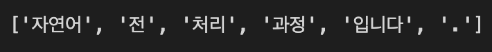
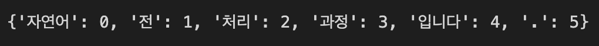
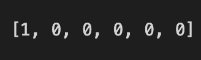

## 원-핫 인코딩(One-Hot Encoding)

지난 게시물인 [정수 인코딩](https://mintyu.github.io/Pytorch03/)에서는 Vocabulary의 각 단어에 인덱스를 부여하는 정수 인코딩까지 마쳤습니다. 그리고 이후 원-핫 인코딩과 워드 임베딩을 통해 단어들을 벡터로 바꿔준다고 말미에 언급했었습니다. 이번 게시물은 그 중 "원-핫 인코딩(One-Hot Encoding)"에 대한 내용입니다.

### 원-핫 인코딩이란?

원-핫 인코딩이란, 단어 집합의 크기를 차원으로 하고 표현하고 싶은 단어의 인덱스에 1의 값을 부여하고, 다른 인덱스에는 0을 부여하는 단어의 벡터 표현 방식입니다. 이렇게 표현된 벡터의 이름이 원-핫 벡터(One-Hot Vector)입니다. 여기서 단어의 인덱스는 앞서 정수 인코딩을 통해 맵핑한 데이터를 기반으로 합니다.

예시로, `"자연어 전처리 과정입니다."` 라는 한글로 된 문장을 원-핫 벡터로 만드는 과정을 보겠습니다.

```python
from konlpy.tag import Okt  
okt = Okt()  
token = okt.morphs("자연어 전처리 과정입니다.")  
print(token)
```

`konlpy` 모듈의 `Okt` 형태소 분석기를 통해 문장에 대해 토큰화를 수행하는 과정입니다.


이 과정에서 `konlpy` 모듈이 설치되지 않았다면 `$pip install konlpy` 명령어를 통해 설치해주시면 되고, 실행 과정에서 No JVM 오류가 발생한다면 JVM 설치를 진행해주시면 됩니다. 필자의 경우 도커 컨테이너 상에서 실습을 진행하고 있기에 `$apt install default-jdk`를 통해 설치를 진행했습니다. (각자의 운영체제 상황에 맞는 설치 방법으로 설치하시면 됩니다.)

실행 결과는 다음과 같습니다.



그리고 아래와 같이 각 토큰에 대해 인덱스를 부여해줍니다.

```python
word2index = {}
for voca in token:
     if voca not in word2index.keys():
       word2index[voca] = len(word2index)
print(word2index)
```

결과는 다음과 같습니다.



```python
def one_hot_encoding(word, word2index):
    one_hot_vector = [0]*(len(word2index))
    index = word2index[word]
    one_hot_vector[index] = 1
    return one_hot_vector
```

위는 토큰을 입력하면 그에 해당하는 원-핫 벡터를 반환해주는 `one_hot_encoding`함수입니다.

다음과 같이 토큰을 통해 함수를 호출하면, 원-핫 벡터를 얻을 수 있습니다.

```python
one_hot_encoding("자연어",word2index)
```



함수에 `"자연어"` 라는 토큰을 입력으로 넣었더니, `[1, 0, 0, 0, 0, 0]` 이라는 원-핫 벡터를 리턴했습니다.

앞에서 `"자연어"` 토큰은 인덱스 0번으로 정수 인코딩이 되었으니, 해당하는 0번 인덱스만 1의 값을 갖는 원-핫 벡터가 나오게 됩니다.

### 원-핫 인코딩의 한계

원-핫 인코딩과 같은 표현 방식은, 단어의 수가 늘어날 수록 벡터의 크기가 점점 커진다는 단점이 있습니다. 단어 집합(Vocabulary)의 크기가 곧 원-핫 벡터의 차수이기 때문에, 단어의 수가 많으면 벡터를 저장하는데 리소스가 많이 필요할 뿐만 아니라 연산에서도 불리합니다.

또한, 원-핫 벡터는 단어의 유사도를 표현하지 못합니다. 원-핫 인코딩을 통해서는 `['오렌지', '사과', '개', '고양이']` 이와 같은 단어 집합이 있을 때, 원-핫 인코딩을 거치면 `[1, 0, 0, 0]`, `[0, 1, 0, 0]`, `[0, 0, 1, 0]`, `[0, 0, 0, 1]` 의 4개의 벡터로 표현됩니다. 인간은 단어 집합을 보고 오렌지와 사과는 과일이며 개와 고양이는 동물이므로 서로 유사한 특징을 묶어낼 수 있지만, 원-핫 벡터로는 그런 내용들을 포함할 수 없습니다. 인간도 단어 집합을 모르는 상태에서 원-핫 벡터만 봐서는 무엇과 무엇이 서로 유사한지 전혀 알 수 없을 것입니다.

따라서 단어 간 유사도까지 표현할 수 있는 워드 임베딩 방식인 Word2Vec을 많이 채택합니다.