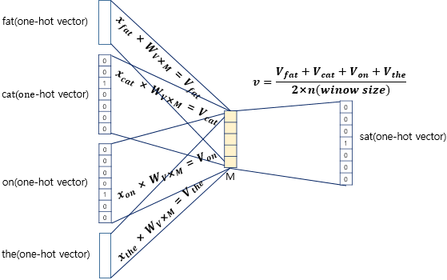
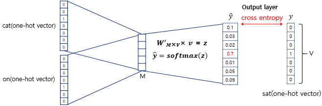

## Word2Vec(워드투벡터)

[원-핫 인코딩](https://mintyu.github.io/Pytorch04/)에서 언급했듯, 원-핫 벡터와 같은 희소 표현(Sparce Representation)은 단어 간 의미의 유사도를 표현할 수 없습니다.

그래서 단어 간 의미의 유사도를 표현할 수 있도록 단어를 벡터화 할 수 있는 방법이 필요합니다.

이 방법을 **분산 표현**(Distributed Representation)이라 합니다. 그리고, 이를 위해 사용되는 가장 대표적인 방식이 **Word2Vec**이라 할 수 있습니다. 

## 분산 표현(Distributed Representation)

분산 표현(distributed representation) 방법은 기본적으로 분포 가설(distributional hypothesis)이라는 가정 하에 만들어진 표현 방법입니다. 이 가정은 **'비슷한 위치에서 등장하는 단어들은 비슷한 의미를 가진다'**라는 가정입니다.

분산 표현은 분포 가설을 이용하여 단어들의 집합을 학습하고, 벡터에 단어의 의미를 여러 차원에 분산하여 표현합니다.

분산 표현으로 벡터화하게 되면, 원-핫 벡터처럼 벡터의 차원이 단어 집합의 크기와 같지 않아도 됩니다. 이에 따라 벡터의 차원은 원-핫 벡터로 표현할 때보다 상대적으로 줄어들게 됩니다.

분산 표현 학습 방법에는 NNLM, RNNLM 등이 있지만, 해당 방법들의 속도를 개선한 Word2Vec이 많이 쓰입니다.

## CBOW(Continuous Bag of Words)

Word2Vec에는 CBOW와 Skip-Gram 두 가지 방법이 있습니다. CBOW는 주변에 있는 단어들을 가지고 중간에 있는 단어들을 예측하는 방법이고, 반대로 Skip-Gram은 중간에 있는 단어로 주변 단어들을 예측하는 방법입니다. 

CBOW 방식의 예를 들면, 예문으로 `"The fat cat sat on the mat"`과 같은 문장이 있다고 할 때, `{"The", "fat", "cat", "on", "the", "mat"}`으로부터 sat을 예측해내는 것입니다. 이 때 예측해야하는 단어 sat을 중심 단어(center word)라고 하고, 예측에 사용되는 단어들을 주변 단어(context word)라고 합니다.

중심 단어를 예측하기 위해서 앞, 뒤로 몇 개의 단어를 볼지를 결정했다면 이 범위를 윈도우(window)라고 합니다. 예를 들어서 윈도우 크기가 2이고, 예측하고자 하는 중심 단어가 sat이라고 한다면 앞의 두 단어인 fat와 cat, 그리고 뒤의 두 단어인 on, the를 참고합니다. 윈도우 크기가 n이라고 한다면, 실제 중심 단어를 예측하기 위해 참고하려고 하는 주변 단어의 개수는 2n이 될 것입니다.

윈도우 크기를 정했다면, 윈도우를 계속 움직여서 주변 단어와 중심 단어 선택을 바꿔가며 학습을 위한 데이터 셋을 만들 수 있는데, 이 방법을 슬라이딩 윈도우(sliding window)라고 합니다.

위 그림에서 좌측의 중심 단어와 주변 단어의 변화는 윈도우 크기가 2일때, 슬라이딩 윈도우가 어떤 식으로 이루어지면서 데이터 셋을 만드는지 보여줍니다. 또한 Word2Vec에서 입력은 모두 원-핫 벡터가 되어야 하는데, 우측 그림은 중심 단어와 주변 단어를 어떻게 선택했을 때에 따라서 각각 어떤 원-핫 벡터가 되는지를 보여줍니다. 위 그림은 결국 CBOW를 위한 전체 데이터 셋을 보여주는 것입니다.

위는 크기가 $M$인 $v$벡터, 즉 투사층(Projection Layer)을 계산하는 과정입니다. 좌측의 입력층(Input Layer)에는 앞서 사용자가 정한 윈도우 크기 범위 내에 있는 주변 단어들의 원-핫 벡터들이 입력으로 주어지게 됩니다.

이 입력값들에 크기가 $V \times M$($V$: 입력에 사용된 원-핫 벡터의 크기, $M$: 투사층 벡터 $v$의 크기)인 가중치(Weight) 행렬 $W_{V \times M}$을 각각 곱해서 모두 더한 뒤, 그 벡터에 window size에 2를 곱한 값을 나눈 벡터, 즉 평균인 $v$를 계산하게 됩니다. 
 

이렇게 구한 벡터는 두번째 가중치 행렬 $W^ \prime _{M \times V}$와 곱해지게 됩니다. 여기에서 나온 결과값은 입력층에서 입력으로 받은 원-핫 벡터의 크기와 같아집니다. 

이 벡터에 CBOW는 소프트맥스(softmax) 함수를 취하는데, 소프트맥스 함수로 인한 출력값은 0과 1사이의 실수로, 각 원소의 총 합은 1이 되는 상태로 바뀝니다. 이렇게 나온 벡터를 스코어 벡터(score vector)라고 합니다. 스코어 벡터의 각 차원 안에서의 값이 의미하는 것은 아래와 같습니다.

스코어 벡터의 j번째 인덱스가 가진 0과 1사이의 값은 j번째 단어가 중심 단어일 확률을 나타냅니다. 그리고 이 스코어 벡터는 우리가 실제로 값을 알고있는 벡터인 중심 단어 원-핫 벡터의 값에 가까워져야 합니다.

스코어 벡터를 $\hat{y}$, 중심 단어를 $y$라고 했을 때, 이 두 벡터값의 오차를 줄이기위해 CBOW는 손실 함수(loss function)로 cross-entropy 함수를 사용합니다.

$$
H(\hat{y}, y) = - \sum_{j=1}^{\left\vert V \right\vert} y_j \log(\hat{y_i})
$$

cross-entropy 함수에 실제 중심 단어인 원-핫 벡터와 스코어 벡터를 입력값으로 넣은 수식은 위와 같습니다.

$$
H(\hat{y}, y) = - y_i \log(\hat{y_i})
$$

중심 단어가 원-핫 벡터라는 것을 감안하면, 식을 위처럼 쓸 수도 있습니다. ($i$는 원-핫 벡터에서 0이 아닌 index)

만약 정확하게 예측한 경우, $\hat{y_i} = 1$ 이 되며, cross-entropy의 값은 $ -1 \times \log(1) = 0$ 이 됩니다. 따라서 해당 식을 최소화하는 방향으로 학습해야 합니다.

이제 역전파(Back Propagation)를 수행하면 $W$와 $W^ \prime$이 학습이 되는데, 학습이 다 되었다면 $M$차원의 크기를 갖는 $W$의 행이나 $W^ \prime$의 열로부터 어떤 것을 임베딩 벡터로 사용할지를 결정하면 됩니다. 때로는 $W$와 $W^ \prime$의 평균치를 가지고 임베딩 벡터를 선택하기도 합니다.

## Skip-gram

Skip-gram은 앞서 설명한 CBOW와 반대의 과정입니다. Skip-gram은 중심 단어를 보고, 어떤 주변 단어들이 올지 예측하기 위한 방법입니다.

위 사진과 같은 과정으로 이루어지며, 중심 단어 하나에 대해서만 입력을 받기 때문에, CBOW처럼 평균을 구하는 과정은 없습니다. 