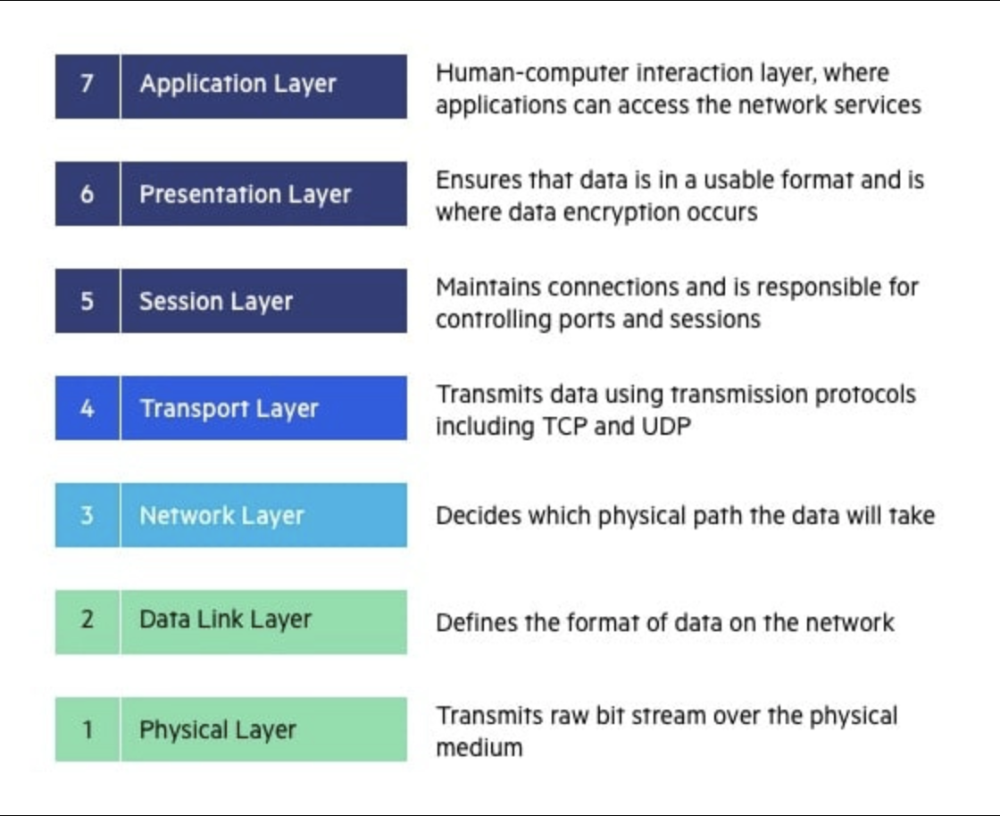
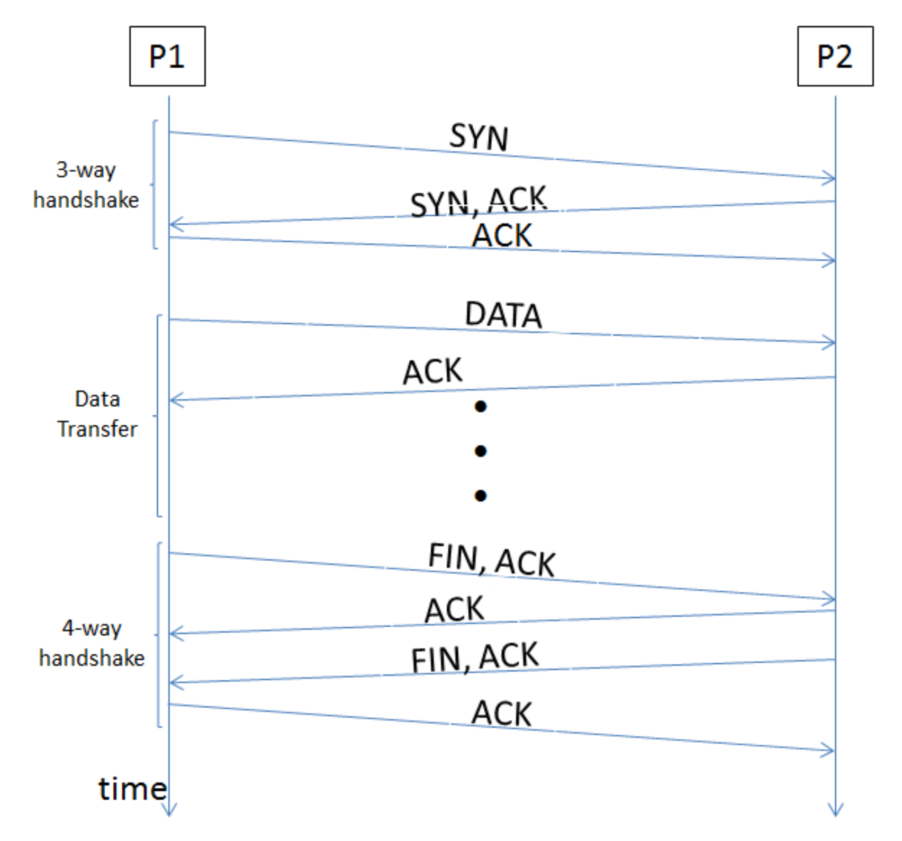
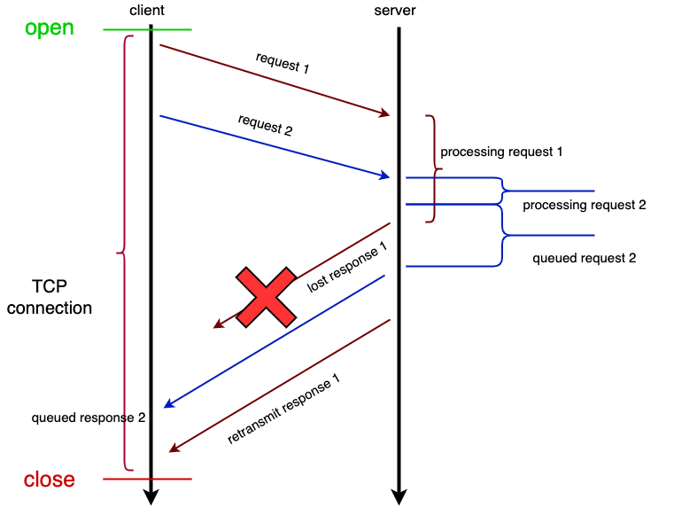
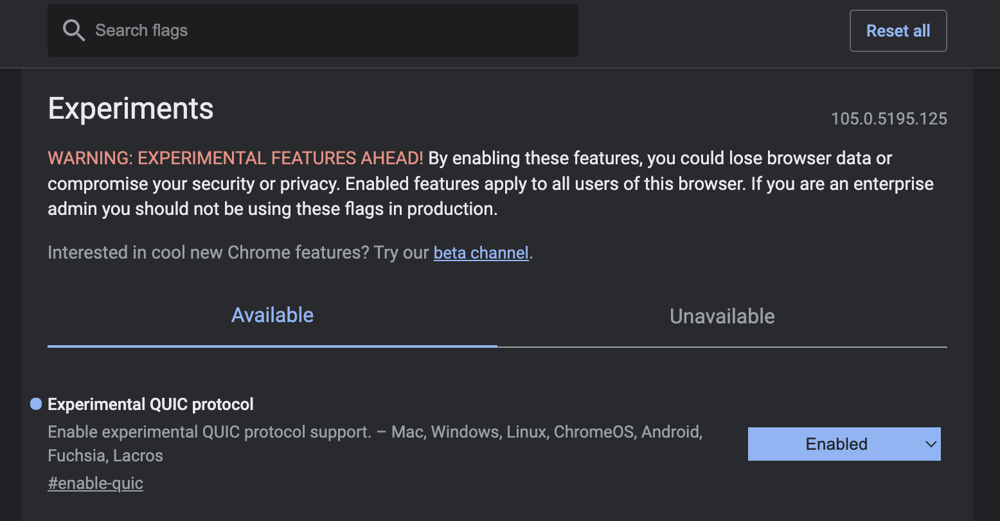
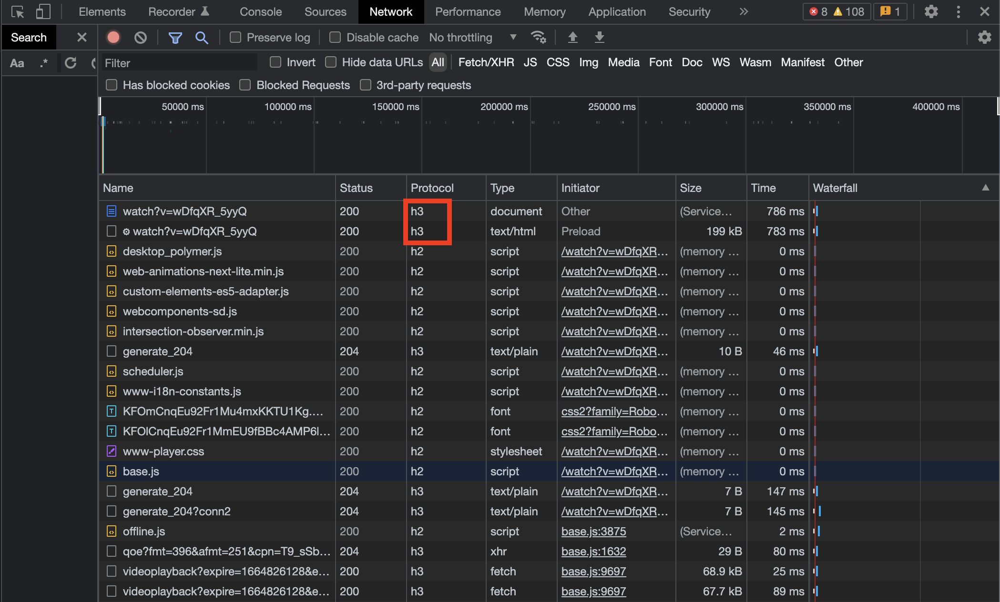

## 0. 전송 계층 프로토콜의 간단한 이해

TCP와 UDP의 비교에 앞서, 전송 계층 프로토콜이 무엇인지 그 개념을 정리해보겠습니다.

컴퓨터 통신이 활성화되면서, 각각의 통신망 별로 각자 다 다른 규칙을 마련하는 것은 너무 비효율적이었습니다. 따라서 어떤 제조사에서 만든 통신 기기에서도, 어떤 네트워크인지 상관 없이 상호 통신이 가능한 규칙이 필요했습니다. 이 과정에서 OSI 7 Layer(OSI 7계층) 개념이 도입되었습니다.

OSI 7 Layer에서는 통신이 일어나는 과정을 7단계로 나누고, 각 단계 별로 통신에서 수행하는 역할을 구분해 두었습니다.

이 중, 전송 계층(Transport Layer)는 4계층에 속합니다. 전송 계층은 하위 계층에 신뢰할 수 있는 데이터 전송 서비스를 제공하는 것이 주 목적이라고 할 수 있습니다. 쉽게 말해서, 컴퓨터와 컴퓨터 간에 통신을 할 때 데이터가 의도한 대로 잘 갔는지 확인하는 역할을 전송 계층이 해준다는 의미입니다. 그리고 이런 전송 계층을 담당하는 대표적인 프로토콜엔 TCP와 UDP가 있습니다.

### - TCP

TCP는 전송 제어 프로토콜(Transmission Control Protocol)의 약자로, 연결 지향적 프로토콜입니다. 따라서 데이터가 전송되기 전, 반드시 클라이언트와 서버의 연결이 이루어지며, 이 연결 과정은 3-Way Handshake 라고 합니다. Handshake가 가진 악수라는 뜻처럼, 네트워크 관련 분야에서는 통신이 시작되기 전 양 측이 악수하는 것처럼 통신 채널의 변수를 설정하는 일련의 과정을 의미합니다. 

1. 클라이언트에서 서버에 연결 요청을 하기 위해 SYN 데이터를 보낸다. 
2. 서버에서 SYN 데이터를 받은 후 정상적으로 데이터를 수신했다는 대답(ACK)와 함께 클라이언트도 포트를 열어달라는 신호인 SYN을 함께 보낸다.
3. 클라이언트는 SYN, ACK 신호를 받고 포트를 열고 서버에 ACK를 전송하게 된다.

TCP는 패킷이라는 가장 작은 단위로 데이터를 전송합니다. 데이터를 전송하는 과정에서 송신자(Sender)가 데이터를 패킷의 형태로 전송하면, 수신자(Reciever)는 데이터를 받은 후 ACK(확인)신호를 송신자에게 다시 전송하게 됩니다. 따라서 송신자는 수신자가 제대로 데이터를 받았는지 확인할 수 있으며, 만약 제대로 전송이 안되었다면 다시 전송해서 수신자가 모든 데이터를 다 받았음을 보장합니다. TCP는 전송하는 패킷에 Sequence number를 매겨서 전송 순서까지 보장할 수 있습니다. 이 과정에서 TCP는 신뢰성 있는 데이터를 전송할 수 있습니다.(빠진 데이터 없이 모두 전송되었는지, 순서는 맞게 전송되었는지 신뢰성을 보장)

### - UDP

UDP는 사용자 데이터그램 프로토콜(User Datagram Protocol)의 약자로, 비연결 지향적 프로토콜입니다. TCP의 전송 단위는 패킷인것처럼, UDP는 데이터그램(Datagram)의 단위로 데이터를 전송하게 됩니다.

TCP에서는 데이터의 전송을 위해 일단 연결을 먼저 수립한것과 반대로, UDP는 연결 과정을 거치지 않고 송신자가 그냥 일방적으로 데이터를 전송하게 됩니다. 연결 과정이 없기 때문에 TCP에 비해 빠른 속도로 데이터를 전송할 수는 있지만, 데이터 전달의 신뢰성은 떨어지게 됩니다. 또한, 직접 연결을 수립한 것이 아니기 때문에 각각의 데이터그램들은 모두 다른 경로로 독립적으로 전송되게 됩니다. 이 과정에서 어떤 경로는 전송 속도가 빠르고, 어떤 경로는 느린 경우가 존재하기 때문에 먼저 전송했다고 먼저 도착할것이라고 보장할 수가 없습니다. 따라서 UDP는 데이터 전송의 순서는 보장받을 수 없습니다.

## 1. 어떤 프로토콜을 이용하는 것이 좋은가?

그렇다면 어떤 프로토콜을 이용해야 하는가?

예상했겠지만, TCP와 UDP 모두 각각의 특징이 뚜렷하기 때문에 무엇을 사용하는 것이 정답이라고 할 수는 없습니다. 구현하고자 하는 서비스가 어떤 프로토콜을 이용했을 때 잘 맞을지 생각해보고, 이를 적용하는 것이 최선이라고 할수 있습니다. 

가령, 파일을 전송한다고 해봅시다. 파일을 전송하는 경우 사용자의 입장에서 물론 파일의 전송이 빠르면 빠를 수록 좋을 것입니다. 하지만, 전달받은 데이터가 뒤죽박죽이 되거나 중간중간 일부분이 전송 실패로 온전하지 못한 파일을 전송받기는 싫을 것입니다. 아무리 속도가 빠르다고 해도, 열수도 없는 파일을 전달받고자 하는 사용자는 아무도 없을 것입니다. 이 경우, 속도에서 어느 정도 타협이 있더라도 전달하고자 하는 파일에 대한 신뢰성을 보장받을 수 있어야 하기 때문에 TCP를 사용하는 것이 더 적합하다고 볼 수 있습니다.

UDP의 경우는 신뢰성있는 데이터의 전송은 보장해주지 못하기 때문에, 신뢰성이 중요한 파일 전송과 같은 서비스보다는 속도가 중요한 스트리밍 서비스 등에 이용할 수 있습니다.

## 2. 성능 향상?

사실 TCP와 UDP 모두 설계되고 사용된지 상당히 오래된 프로토콜이고, 그에 따라 프로토콜의 성능을 향상시키려는 시도가 많이 있었습니다. 특히 TCP의 단점인 느린 속도를 커버하기 위해 다양한 노력들이 있었지만, TCP의 느린 속도의 주범이라고 지목받은 3-Way Handshake를 근본적으로 해결할 수가 없었습니다.

또한, TCP는 HOL Blocking(Head Of Line Blocking)이라는 문제를 안고 있었습니다. TCP를 사용한 HTTP의 전송 지연 시간을 줄이기 위해 Pipelining을 통해 한 번에 여러 개의 요청을 보내게 되면, ACK가 도착하기 전까지 발생하는 지연을 줄일 수가 있었습니다. 하지만, 가장 먼저 전송된 요청에 대해 처리가 늦어지면 그 뒤에 전송된 요청들에 대한 처리도 함께 밀리게 되는 상태가 됩니다. 이를 HOL Blocking이라고 하게 됩니다. Pipelining을 통해 지연 시간은 조금 줄일 수 있어도 TCP를 사용하는 이상 HOL Blocking에 대한 문제는 안고 갈 수밖에 없었습니다.

사실상 3-Way Handshake와 HOL Blocking 문제를 근본적으로 해결하기 위해서는 TCP를 포기해야만 했고, 그로 인해 구글은 UDP로 눈을 돌립니다.

## 3. QUIC의 탄생

QUIC은 UDP를 기반으로 한 전송 계층 프로토콜로, 구글의 짐 로스킨드가 처음 설계한 프로토콜입니다.

QUIC이 생소할 수도 있지만, 이미 구글은 많은 서비스에서 이를 사용하고 있습니다.

주소창에 `chrome://flags/`로 들어가면 다양한 기능을 사용할 수 있습니다. 이 중, "Experimental QUIC protocol" 항목을 활성화시켜주시면, QUIC 프로토콜을 사용한 전송을 허용할 수 있습니다. 만약 인터넷을 사용하는데 들어간 사이트가 QUIC 프로토콜을 지원한다면, QUIC을 통한 전송을 허용하는 것입니다. 아직 완벽한 상태는 아니기에 크롬에서도 실험항목으로 남겨둔 것 같습니다.

그러고 유튜브로 들어가서 프로토콜을 확인하면 h3(HTTP/3) 프로토콜이 적용된 것을 확인할 수 있습니다. HTTP/3 버전의 표준이 QUIC 프로토콜이므로 잘 적용된 것을 확인할 수가 있습니다.

지금까지 HTTP는 TCP를 기반으로 작성되었고, 앞서 말한 TCP의 고질적인 문제를 고칠 수 없었기에 구글은 QUIC 프로토콜을 제안하였으며 이는 HTTP/3의 표준으로 인정받게 됩니다.

여기까지 전송 계층 프로토콜에 대한 설명과, QUIC의 탄생 배경에 대해서 알아보았습니다. 다음 글에서는 어떻게 UDP를 통한 QUIC으로 신뢰성있는 전송이 필요한 HTTP 프로토콜의 기반으로 쓰일 수 있었는지, 그리고 QUIC 프로토콜의 특징은 무엇인지 알아보도록 하겠습니다.