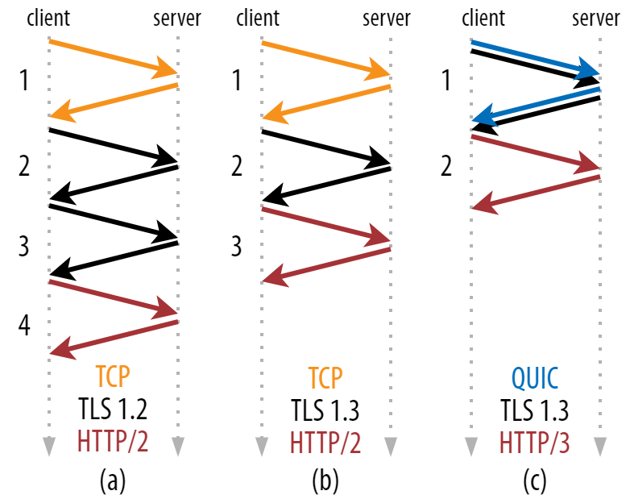
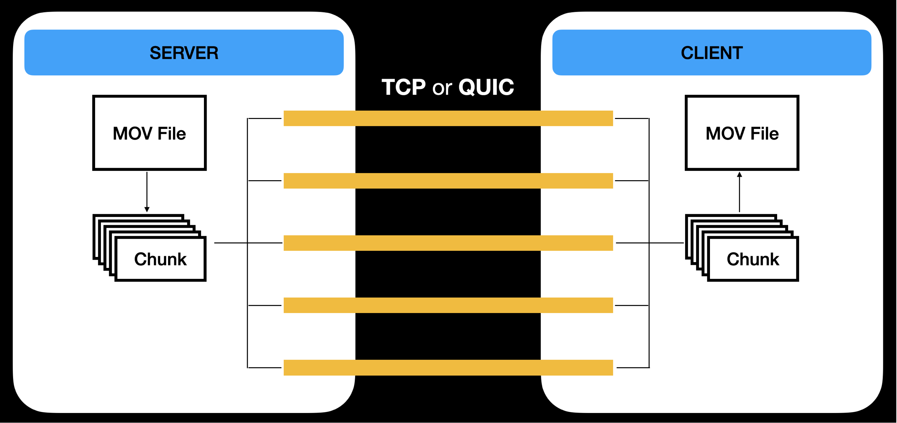

## 4. QUIC 소개

앞선 글에서 설명했듯, QUIC은 UDP를 기반으로 만들어진 전송 계층 프로토콜입니다. 하지만, 기존에 TCP를 필요로 하던 HTTP에서 TCP의 자리를 UDP 기반의 QUIC 프로토콜이 차지했다는 사실은, UDP의 특징을 이해하고 있다면 다소 아이러니하게 들릴 수도 있습니다.

물론, UDP는 데이터 전송의 신뢰성을 보장하지 못하지만, QUIC은 UDP 위에 새로운 계층을 추가하면서 신뢰성을 제공하게 됩니다. 이 추가된 계층은, 기존 TCP의 기능이었던 패킷 재전송이나 혼잡 제어, 속도 조정과 같은 기능을 제공해주게 되면서 UDP 기반 통신에도 신뢰성을 확보할 수 있게 되었습니다. 뿐만 아니라 TCP가 원래는 커널 내부에 구현되어있었지만, QUIC의 혼잡 제어 알고리즘은 어플리케이션으로 구현되어 수정이 쉽고 최적화가 용이하다는 장점이 있습니다.

### QUIC의 특징

QUIC은 기존 TCP의 단점으로 지적된 점들을 해결하기 위해 신경 쓴 모습을 많이 볼 수 있습니다. 그 첫 번째는 연결에서 볼 수 있습니다. TCP는 3-Way Handshake를 거처 연결을 수립해야 하는 반면, QUIC은 1-RTT(1-Round Trip Time)으로 연결이 수립되며, 이전에 서버에 연결한 적이 있는 클라이언트와의 연결은 0-RTT로 연결이 수립되고 이론상 Handshake가 완료되기를 기다리지 않고 바로 데이터 전송을 시작할 수 있습니다. 이를 통해 연결 수립에 필요한 시간을 획기적으로 줄일 수 있었습니다.

두 번째로 3-Way Handshake와 함께 TCP의 문제점이라고 할 수 있었던 HOL Blocking 문제를 해결한 점도 눈에 띕니다. TCP 기반의 HTTP/2를 사용하는 대부분의 브라우저는 하나의 TCP 연결을 통해 수십, 수백 개의 병렬 전송을 합니다. 하지만, QUIC은 서로 다른 여러 개의 Stream을 설정하고 독립적으로 다룰 수 있기 때문에 특정 Stream에서 전송되던 데이터의 손실에도 다른 Stream의 전송에 영향을 주지 않습니다. 따라서, 패킷 손실률이 큰 환경에서 QUIC의 성능은 더 돋보이게 됩니다.

세 번째 눈에 띄는 특징은 TLS(Transport Layer Security)입니다. TCP의 경우 따로 보안기능이 없었기 때문에, 보안 연결을 위해서는 반드시 TLS를 함께 사용해야 했습니다. 또한, TLS 연결을 수립하는 과정에서도 추가적인 Handshake가 필요했기에 TCP의 연결 시간 지연을 더더욱 부각시키는 상태였습니다. 하지만, QUIC은 TLS 1.3의 전송 보안을 기본으로 탑재하고 있습니다. TLS 1.3버전은 이전 버전과 비교했을 때 Handshake에 더 적은 RTT가 필요해졌기에 더 빠를 뿐만 아니라, TCP 연결 따로, TLS 연결 따로 순차적으로 진행하던것과 달리 QUIC은 연결과 동시에 TLS Handshake를 함께 진행합니다.

## 5. QUIC이 TCP를 대체 가능할까?

QUIC을 살펴보다 보면, 정말 TCP를 대체할 수 있을 것 같은 느낌이 듭니다. 오히려, TCP에서 고질적으로 발생하던 문제들도 해결되었고 QUIC이 속도도 더 빠를 것 같다는 생각이 듭니다.

정말 QUIC이 TCP의 대안으로 사용될 수 있을지, 실험을 통해 알아보도록 하겠습니다.

### 실험 설계

우선, 성능 평가 분야는 "파일 전송"으로 선정했습니다. 크기가 같은 파일을 전송 프로토콜만 다르게 하여 전송하는 시간을 측정하여 간단하게 프로토콜의 전송 성능을 측정할 수 있을 것입니다.

실험의 전체 틀은 아래와 같습니다.

전송에 사용할 파일은 mov 형식의 동영상 파일을 실험에 사용하기로 했습니다. 중간에 데이터가 손실되어 제대로 전달되지 않았을 경우, 영상이 정상적으로 재생되지 않기 때문에 영상을 실행시켜보면 정상적으로 모두 전송이 되었는지 간단하게 확인할 수 있습니다.

TCP는 1:1 통신만 가능하기 때문에, 단일 TCP 연결을 통해 병렬 전송을 하게 됩니다. Stream 세션을 병렬로 늘릴 수 있는 QUIC과의 성능을 비교해보기 위해서, TCP 연결을 병렬로 여러개 수립해서 병렬 전송을 해 보고, 전송 성능이 향상되는지 측정해 보고 QUIC의 경우와 비교해 보도록 하겠습니다.

또한 전송 속도가 빠를 때, 전송 속도가 느릴 때 속도의 차이도 비교하기 위해 근거리 네트워크, 장거리 네트워크의 경우를 각각 나누어 성능을 비교합니다.

실험의 세부 설계는 아래와 같습니다.

#### - 서버 SW 설계 및 개발
실험에 사용된 서버 SW는 전송할 파일을 일정한 크기로 chunk 형태로 분할합니다. 분할되는 chunk의 수는 실험 시 클라이언트와 수립되는 연결의 수와 같습니다. 각각의 chunk는 번호가 매겨지며, 각각의 연결 당 한 개의 chunk를 전달합니다. 각 연결들을 통한 멀티스레딩을 통해 동시에 이뤄집니다. TCP 연결의 경우, TLS 연결 없이 순수 TCP 연결만 1개~6개로 전송하는 경우와 TLS 연결을 포함한 TCP 연결 1개~6개로 전송하는 경우를 각각 측정하며, QUIC 또한 Stream을 1개~6개로 늘려가며 파일을 분할 전송하게 됩니다.

서버 SW는 Golang을 이용, [github.com/lucas-clemente/quic-go](https://github.com/lucas-clemente/quic-go) 라이브러리를 통해 QUIC 전송을 구현했으며, TCP는 기본 패키지 net을 통해 전송을 구현했습니다. TCP+TLS는 crypto/tls 패키지를 통해 구현했습니다. TCP(+TLS) 서버는 나눠진 chunk들을 전송할 수 있도록 chunk당 하나의 TCP(+TLS) 연결을 생성합니다. 그리고 각각의 chunk들을 연결을 통해 전송합니다. chunk 순서는 클라이언트가 연결을 시도하는 순서와 같습니다. 주어진 chunk를 모두 전송한 경우, TCP(+TLS) 연결을 종료하며 클라이언트 측에 EOF를 전달합니다. QUIC 서버는 마찬가지로 나눠진 chunk들을 전송할 수 있도록 chunk당 하나의 stream 연결을 생성합니다. 그리고 각각의 chunk들을 stream을 통해 전송합니다. chunk의 순서 또한 TCP와 마찬가지로 클라이언트가 연결을 시도하는 순서와 같습니다.

주어진 chunk를 모두 전송하게 되면 EOF를 전송한 후 QUIC stream이 닫히게 되고, 모든 전송이 완료되어 모든 stream이 닫히게 되면 QUIC 연결이 끊어집니다. 이 부분에서 클라이언트에 모든 데이터들이 도달하기 전에 서버는 모든 파일을 전송 완료 후 stream을 닫아버리게 되면 QUIC 연결이 끊기고 마지막 1~2개정도의 버퍼가 클라이언트에 도달하지 않는 문제가 있으므로, 모든 전송이 완료되었는지를 확인할 수 있는 별도의 stream을 열어 클라이언트가 모든 파일 수신을 완료한 후 보내는 신호를 수신 후 stream을 닫아 조기에 QUIC 연결이 끊어지는 것을 방지해야 합니다.

#### - 클라이언트 SW 설계 및 개발
클라이언트는 서버에 연결 후 서버가 보내는 모든 chunk 파일들을 받습니다. 연결 시도 순서가 chunk 순서와 같기 때문에 연결 순서대로 받은 chunk에 똑같이 번호를 매긴후, 원래 파일과 같은 형태로 합쳐주는 과정을 거칩니다. 파일 수신 또한 서버와 마찬가지로 멀티스레딩을 통해 동시에 이루어집니다. 모든 클라이언트는 시작 시간부터 연결 완료 시간, 전송 완료 시간을 각각 로그를 통해 출력하여 작업 시간을 측정합니다.

TCP(+TLS) 클라이언트는 서버와 동일한 수의 TCP(+TLS) 연결을 진행하며, 각각의 연결을 통해 서버가 보낸 EOF를 받으면 수신을 종료하고 연결을 닫습니다. 모든 파일을 다 수신하면 수신한 모든 chunk를 순서에 맞춰 하나로 합쳐줍니다. TCP+TLS 클라이언트에서 서버로 복수로 연결을 시도할 시, 앞서 연결된 TCP+TLS를 통해 데이터가 한번도 이동하지 않았다면 이후 시도되는 연결은 앞의 연결과 동일한 연결 시도(동일한 인증서 사용으로 인함)로 파악해 TCP+TLS 연결의 경우 매 연결 시작 직후 데이터를 전송해 다른 연결 시도임을 확인시킵니다.

QUIC 클라이언트는 마찬가지로 서버와 동일한 수의 QUIC stream을 통해 파일 chunk들을 수신하게 되며, 추가로 stream을 하나 더 열어 모든 연결을 통해 서버로부터 EOF를 수신하고 정상적으로 파일을 모두 받은 것을 확인하면 서버를 닫아도 괜찮다는 신호를 보내게 됩니다. 그렇게 연결이 모두 끊어진 뒤, 받은 chunk들을 하나의 파일로 합칩니다.

여기까지 실험 설계를 마쳤으니, 다음 글에서 실험 결과를 보도록 하겠습니다.