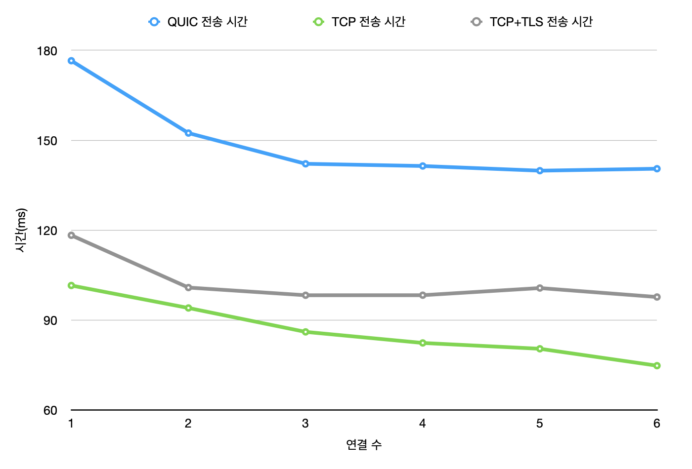
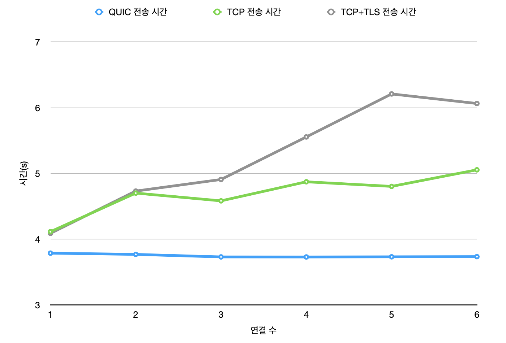
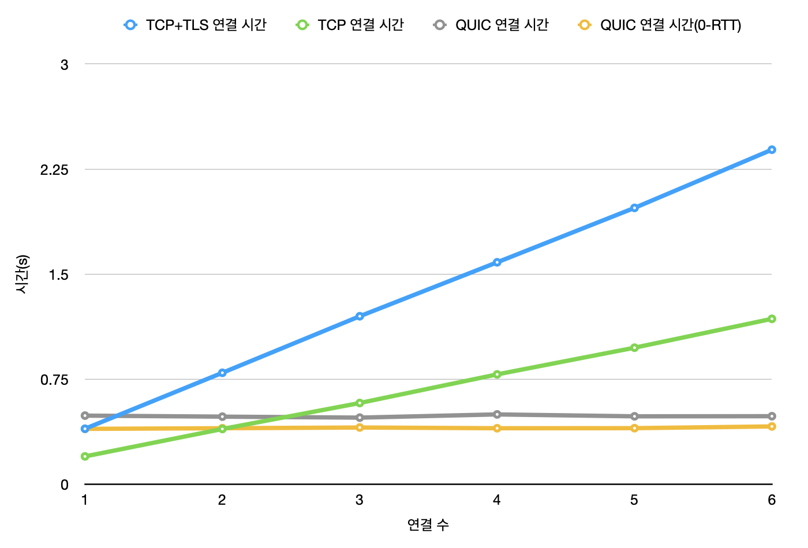
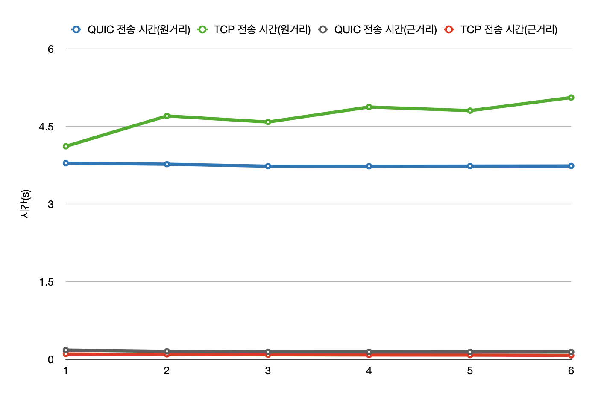

## 6. 실험 결과

### 근거리 네트워킹 실험

근거리 네트워킹 실험에서는 동일한 기기 상에서 서버와 클라이언트를 각각 실행한 환경에서 파일을 전송 후 성능을 측정했습니다.

해당 실험 환경의 Round Trip Time은 min / avg / max / stddev = 0.037 / 0.079 / 0.149 / 0.026 ms 입니다.

TCP, TCP+TLS, QUIC 각각 1개에서 6개로 연결을 병렬로 늘려가며 실험했습니다. 실험 결과는 각 케이스마다 10회 전송 후 전송 시간의 평균을 도출했습니다.

실험 결과, QUIC이 더 느린 것으로 나타났으며 TCP 연결이 오히려 더 빨랐고, TLS까지 사용했을 경우 TLS 연결에 필요한 추가적인 시간만큼 더 지연이 생겼으며 그조차도 QUIC보다는 빨랐습니다.

RTT 값이 매우 극단적으로 작은 환경에서 실험했기 때문에, 이 경우는 TCP의 문제점으로 지적했던 3-Way Handshake 연결 설정이나 HOL Blocking 문제가 크게 나타나지 않았습니다. RTT 값이 극단적으로 작기 때문에 3-Way Handshake를 통한 연결 수립에 큰 시간이 걸리지 않았을 뿐만 아니라 Packet Loss도 0%로 전혀 발생하지 않았기 때문에 HOL Blocking으로 인한 문제도 발생하지 않았기 때문입니다.

또한 근거리 네트워킹 실험에서는 연결 수립에 필요한 시간이 워낙 짧다 보니 연결 수를 늘려 병렬 파일 전송을 했을 경우 전송 시간이 줄어드는 것까지 확인할 수 있었습니다.

### 원거리 네트워킹 실험

이번엔 RTT 값이 매우 큰, 해외 서버에서 데이터를 전송받는 경우를 가정해봅시다. 원거리 네트워킹 실험의 환경을 구축하기 위해서 AWS EC2 서비스를 이용했습니다.

us-east-1 서버(미국 동부 - 버지니아 북부)를 이용하여, 2 vCPU와 4 GiB 메모리의 t2.medium 인스턴스로 서버를 동작했습니다.

해당 실험 환경의 Round Trip Time은 min / avg / max / stddev = 194.567 / 195.514 / 208.020 / 1.646 ms 입니다.

마찬가지로 TCP, CP+TLS, QUIC 각각 1개에서 6개로 연결을 병렬로 늘려가며 실험하였으며 각 케이스마다 10회 전송 후 전송 시간의 평균을 도출했습니다.

원거리 환경이 되자 결과가 뒤집혔습니다. 이 경우 QUIC이 TCP보다 전송 속도가 더 빨랐습니다.

자세한 결과 분석을 위해 파일 전송 시간에서 연결을 수립하는 데 걸린 시간만 따로 측정해보았습니다. 아래는 그 결과 그래프입니다.

TCP 연결의 수를 늘릴수록 점점 연결에 필요한 시간이 증가했습니다. 이에 반해, QUIC의 경우 연결 후 Stream을 늘렸지만 별다른 연결 시간 증가는 확인할 수 없었습니다.

뿐만 아니라, QUIC은 2번째 전송부터는 0-RTT로 바로 데이터 전송을 시도할 수 있습니다. 이에 따라 그래프에서 연결 시간이 기존보다 더 줄어든것까지 확인할 수 있습니다.

### 요약

RTT가 매우 작은 환경인 경우에는 TCP 전송이 더 빨라 유리하지만, RTT가 커지기 시작하면(일반적으로 서비스하는 경우) TCP보다 **QUIC을 통한 파일 전송이 더 유리할 수도 있다**.

## 7. 결론

앞선 실험 결과에서 알 수 있듯, RTT 값에 따라서 RTT 값이 작은 경우 TCP가 유리할 수는 있으나, 대부분의 서비스 환경에서의 RTT 수준이면 QUIC을 통한 파일 전송을 충분히 사용할 수 있을 것이라고 보이며, 충분히 경쟁력 있다고 생각합니다.

아직 QUIC이 완벽히 정착되지 않았고, 최적화도 부족하며 무엇보다 충분한 Document와 Community가 축적될 시간이 없었다는 점에서 아쉽다고 느낄 수는 있으나, 실험 결과 충분히 TCP를 대체할만한 경쟁력을 갖추고있다고 생각됩니다.

특히 병렬 전송이 필요한 경우에 TCP는 하나의 연결에 1:1 통신밖에 되지 않아서, 복수 개의 연결을 수립하고 병렬 전송해야 하기 때문에 이 과정에서 연결 추가에 따른 오버헤드가 발생했습니다. 하지만 QUIC은 Stream을 늘리는 데 별다른 시간 소모가 추가적으로 필요하지 않기 때문에 병렬 전송이 필요한 분야에서는 TCP보다 QUIC이 압도적으로 유리함을 실험을 통해 확인할 수 있었습니다.