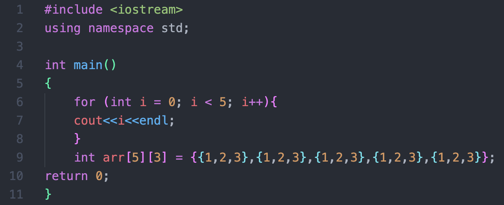
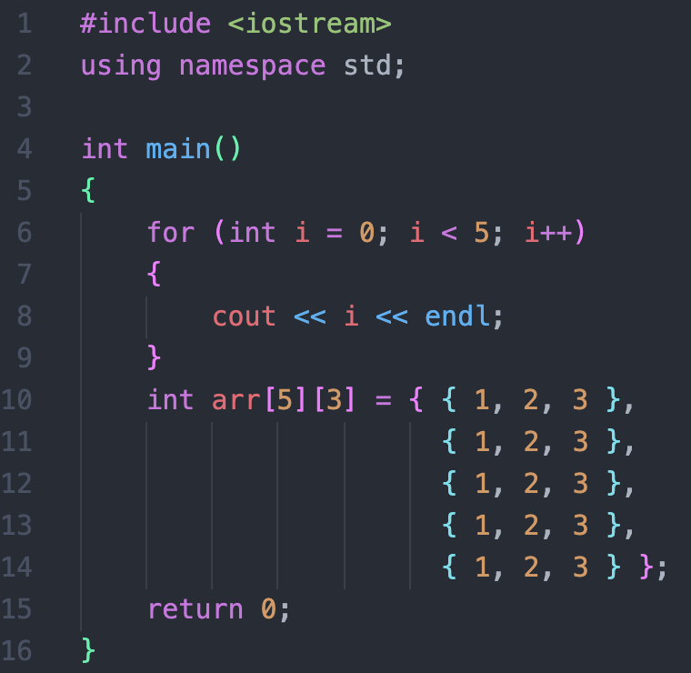
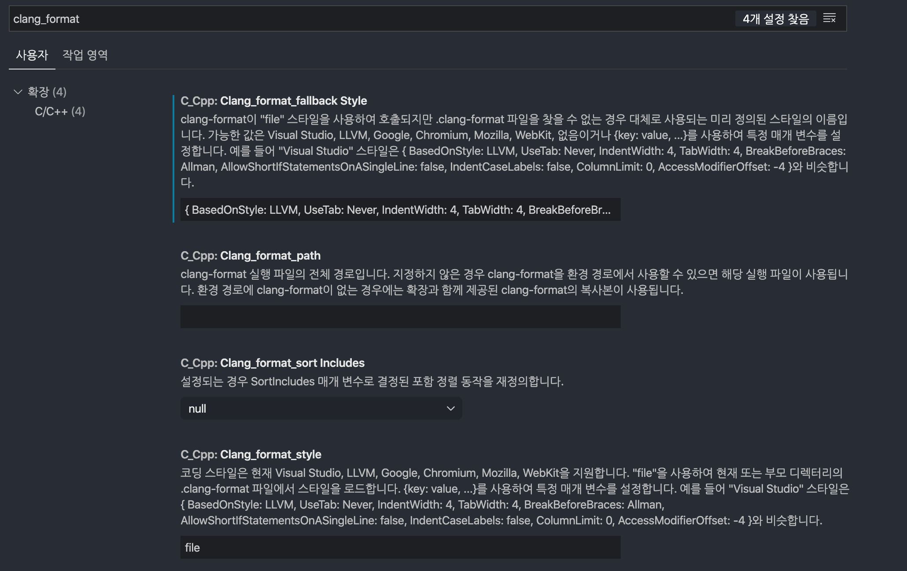

## VSCode Format?

VSCode에는 지정된 형식으로 코드를 깔끔하고 예쁘게 정리해줄 수 있는 기능이 존재합니다.

그 기능은 바로 Format 기능인데, VSCode에서 별다른 설정을 만지지 않았다면 `⌥ + ⇧ + F`로 실행할 수 있습니다. (Windows 운영체제의 경우 `Alt + Shift + F`)

아무생각없이 코딩을 하다 보면, 다음과 같이 가독성이 떨어질 수 있습니다.



중괄호가 시작하는 위치도 일정하지 않고, 들여쓰기도 일관적이지 않습니다.

뿐만 아니라, 연산자와 변수가 붙어있고 배열 안의 항목들도 붙어있어 가독성이 매우 떨어집니다.

(괄호에 적용된 색은 `Bracket Pair Colorizer`라는 Extention이며, 괄호의 쌍을 찾기 쉽게 색을 지정해준다. Extension에 관한 내용은 추후에 따로 포스트할 예정!)

이럴 떄, 앞에서 설명했던 Format 기능을 실행하면 다음과 같이 코드가 변하게 됩니다.



중괄호 시작 위치와 들여쓰기를 일정하게 맞춰주며, 띄어쓰기를 자동으로 적절한 위치에 삽입해줘서 가독성을 좋게 해줍니다.

하지만, 아무 설정도 하지 않았다면 배열의 원소들을 둘러싸고 있는 중괄호 사이는 떨어지지 않습니다.

중괄호와 원소 사이의 간격을 띄우게 되면 원소를 더 명확하게 구분할 수 있으며 가독성 향상에 도움을 주기 때문에 따로 설정해주는 것을 추천해 드립니다.

설정 방법은 아래와 같습니다.

### 배열 원소와 중괄호 사이 띄어쓰기 설정

우선, 설정을 위해서는 `⌘ + ,`를 통해 설정 탭을 열어줍니다. (Windows의 경우 `Ctrl + ,`)

그리고 `clang_format`을 검색해주면 다음과 같은 항목들을 볼 수 있습니다.



가장 위에 나오는 `Clang_format_fallback Style`항목은 따로 설정해주지 않았다면 지금 스크린샷에 나온것과 달리 `Visual Studio`라고 적혀있을 것입니다.

설명에 쓰여 있는 것처럼 `Visual Studio`, `LLVM`, `Chromium`, `Google` 등의 스타일 세트를 따로 지정해줄 수도 있고,

`{key: value ...}`와 같은 형태로 직접 세부 스타일 하나하나 따로 지정해줄 수도 있습니다.

`Visual Studio` 스타일을 `{key: value ...}`형태로 쓰면 다음과 같습니다.

```
{ BasedOnStyle: LLVM,
UseTab: Never,
IndentWidth: 4,
TabWidth: 4,
BreakBeforeBraces: Allman,
AllowShortIfStatementsOnASingleLine: false,
IndentCaseLabels: false,
ColumnLimit: 0,
AccessModifierOffset: -4 }
```

위에서 제일 마지막에 `Cpp11BracedListStyle`이라는 하나의 항목을 더 추가해주고 false로 설정하면 끝입니다.

```
{ BasedOnStyle: LLVM,
UseTab: Never,
IndentWidth: 4,
TabWidth: 4,
BreakBeforeBraces: Allman,
AllowShortIfStatementsOnASingleLine: false,
IndentCaseLabels: false,
ColumnLimit: 0,
AccessModifierOffset: -4,
Cpp11BracedListStyle: false }
```

이 항목을 그대로 복사해서 `Clang_format_fallback Style` 설정의 입력란에 넣으시면 설정이 완료됩니다.

### 저장하면서 형식 지정해주기(Format On Save)

단축키가 상당히 불편하고 외우기 어렵다보니, 저장과 동시에 Formatting을 해주는 기능을 이용하는 것이 훨씬 간편합니다.

이 설정 방식은 아까와 같이 우선 `⌘ + ,`를 통해 설정 탭을 열어줍니다. (Windows의 경우 `Ctrl + ,`)

그리고 `format on save`를 검색해주면 다음과 같은 설정이 있습니다.


체크박스에 체크를 해주시면 앞으로는 저장과 동시에 자동으로 Format 기능을 실행할 수 있습니다!
