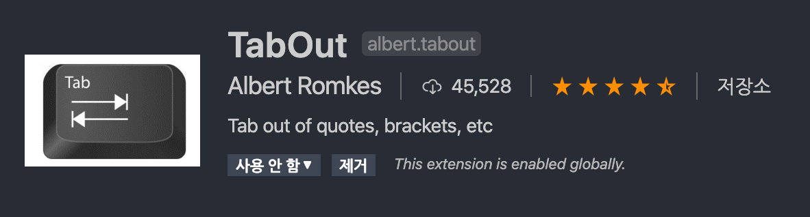

## VSCode 괄호 Tab키로 나가기

VSCode에는 기본적으로 괄호를 한 쪽`" ( "` 입력하면 나머지 한 쪽도 자동 완성되어 `" ( ) "`이렇게 입력됩니다.

이 자동완성 기능을 끄는 방법도 있겠지만, 어차피 괄호를 열었다면 닫는 버튼을 한번 더 입력해야하는 것은 마찬가지입니다.

다른 IDE나 Editor에서는 `Tab`버튼을 통해 괄호나 따옴표 밖으로 나가는 것을 지원하는것 같았는데 VSCode 자체에서는 그 기능을 찾을 수가 없었습니다.

그래서 더 쉽게 괄호를 탈출하는 방법은 없을까 해서 찾던 중, [깃허브](https://github.com/microsoft/vscode/issues/22864)에서 그 해결 방법을 찾을 수 있었습니다.

바로 **"TabOut"**이라는 Extension입니다.

### 설치

좌측 메뉴에서 Extension 탭을 선택한 후, 마켓플레이스에서 `"TabOut"`을 검색한 후 설치해줍니다.

설치가 완료되었다면 탭을 통해 쌍(Pair)이 있는 괄호나 따옴표의 한 단계 밖으로 나갈 수 있습니다.
