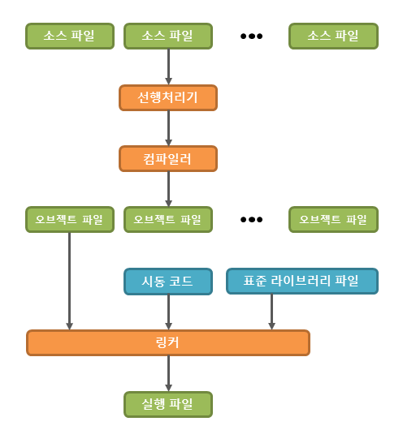

## C++의 특징

C++이 프로그래밍 언어로써 가지는 특징은 다음과 같습니다.

 

1. C++은 절차 지향적이며 구조적 프로그래밍 언어입니다.

2. C++은 객체 지향 프로그래밍 언어입니다.

3. C++은 일반화 프로그래밍 언어입니다.

 

이처럼 C++은 세 가지 프로그래밍 방식을 모두 지원하는 언어이며, 따라서 다양한 방식으로 프로그램을 작성할 수 있습니다.

또한, 다양한 시스템에서의 프로그래밍을 지원하는 유용하고도 강력한 클래스 라이브러리들이 아주 많이 제공됩니다.


## 실행 파일 생성 과정



1. 소스 파일(source file)의 작성

2. 선행처리기(preprocessor)에 의한 선행처리

3. 컴파일러(compiler)에 의한 컴파일

4. 링커(linker)에 의한 링크

5. 실행 파일(executable file)의 생성

## 기본 구조

간단한 C++ 프로그램의 기본 구조는 다음과 같습니다.

언제나 다음과 같이 구성되는 것은 아니지만 많은 C++ 프로그램이 이와 비슷한 형태로 구성됩니다.

> 문법
> ``` cpp
> #include 문
> 
> #define 문
> 
>  
> 
> int main()
> 
> {
> 
>     명령문;
> 
>     return 문;
> 
> }
> ```

간단한 텍스트를 출력하는 예제는 다음과 같습니다.

> 예제
> ``` cpp
> #include <iostream>
> 
> #define TEXT "Welcome to C++ Programming!!"
> 
>  
> 
> int main()
> 
> {
> 
>     std::cout << TEXT; // Welcome to C++ Programming!!
> 
>     return 0;
> 
> }
> ```

### main() 함수

C++ 프로그램은 가장 먼저 main() 함수를 찾고, 그곳에서부터 실행을 시작합니다.

따라서 모든 C++ 프로그램은 반드시 하나의 main() 함수를 가지고 있어야 합니다.

만약 main() 함수를 발견하지 못하면 C++ 컴파일러는 오류를 발생시킬 것입니다.

### 명령문(Statement)

C++ 프로그램의 동작을 명시하고, 이러한 동작을 컴퓨터에 알려주는 데 사용되는 문장을 명령문(statement)이라고 합니다.

이러한 C++의 모든 명령문은 반드시 세미콜론(;)으로 끝나야 합니다.

> ``` cpp
> std::cout << "C++ 프로그래밍"; // 정상적으로 출력됨.
> 
> std::cout << "C++ 프로그래밍"  // 오류가 발생함.
> 
> ```

### 반환문(Return)

반환문은 함수의 종료를 의미하며, 함수를 호출한 곳으로 결괏값을 반환하는 역할을 합니다.

특히 main() 함수가 반환되면, 프로그램 전체가 종료됩니다.

### 선행처리문(Preprocess)

\#include 문과 #define 문은 모두 선행처리기에 의해 처리되는 선행처리문입니다.

 

\#include 문은 외부에 선언된 함수나 상수 등을 사용하기 위해서 헤더 파일의 내용을 현재 파일에 포함할 때 사용합니다.

C언어에서는 헤더 파일에 .h 확장자를 사용했지만, C++에서는 헤더 파일의 확장자를 사용하지 않기로 합니다.

따라서 기존 C언어 헤더 파일들의 이름 앞에 c를 추가하여 C++ 스타일의 헤더 파일로 변환하기도 합니다.
> ``` cpp
> #include <math.h> // C, C++ 모두 허용
> 
> #include <cmath>  // C++에서만 허용
> ```

물론 원칙은 위와 같이 바뀌었지만 C++ 프로그램에서는 기존의 C언어 스타일로도 헤더 파일을 사용할 수 있습니다.

\#define 문은 함수나 상수를 단순화해주는 매크로를 정의할 때 사용합니다.