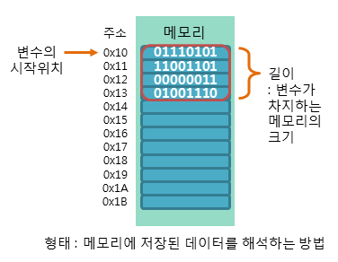

## 변수(Variable)

변수(variable)란 데이터(data)를 저장하기 위해 프로그램에 의해 이름을 할당받은 메모리 공간을 의미합니다.

즉, 변수란 데이터(data)를 저장할 수 있는 메모리 공간을 의미하며, 이렇게 저장된 값은 변경될 수 있습니다.

 

C++에서 숫자 표현에 관련된 변수는 정수형 변수와 실수형 변수로 구분할 수 있습니다.

또다시 정수형 변수는 char형, int형, long형, long long형 변수로, 실수형 변수는 float형, double형 변수로 구분됩니다.

## 변수의 이름 생성 규칙

C++에서는 변수의 이름을 비교적 자유롭게 지을 수 있습니다.

변수의 이름은 해당 변수에 저장될 데이터의 의미를 잘 나타내도록 짓는 것이 좋습니다.

 

C++에서 변수의 이름을 생성할 때 반드시 지켜야 하는 규칙은 다음과 같습니다.

 
1. 변수의 이름은 영문자(대소문자), 숫자, 언더스코어(_)로만 구성됩니다.

2. 변수의 이름은 숫자로 시작될 수 없습니다.

3. 변수의 이름 사이에는 공백을 포함할 수 없습니다.

4. 변수의 이름으로 C++에서 미리 정의된 키워드(keyword)는 사용할 수 없습니다.

5. 변수 이름의 길이에는 제한이 없습니다.

**C++은 변수의 이름에 대소문자를 구분합니다!**

## 변수와 메모리 주소

변수는 기본적으로 메모리의 주소(address)를 기억하는 역할을 합니다.

메모리 주소란 물리적인 메모리 공간을 서로 구분하기 위해 사용되는 일종의 식별자입니다.

즉, 메모리 주소란 메모리 공간에서의 정확한 위치를 식별하기 위한 고유 주소를 의미합니다.

 

변수를 참조할 때는 메모리의 주소를 참조하는 것이 아닌, 해당 주소에 저장된 데이터를 참조하게 됩니다.

따라서 변수는 데이터가 저장된 메모리의 주소뿐만 아니라, 저장된 데이터의 길이와 형태에 관한 정보도 같이 기억해야 합니다.

 

다음 그림은 메모리상에 변수가 어떤 식으로 저장되는지를 보여줍니다.



이 내용은 포인터의 개념을 이해하기 위해 필요한 개념이므로 익혀두는 것이 좋습니다.

## 변수의 선언

C++에서는 변수를 사용하기 전에 반드시 먼저 해당 변수를 저장하기 위한 메모리 공간을 할당받아야 합니다.

이렇게 해당 변수만을 위한 메모리 공간을 할당받는 행위를 변수의 선언이라고 부릅니다.

 

C++에서 변수를 선언하는 방법에는 다음과 같이 두 가지 방법이 있습니다.

 

1. 변수의 선언만 하는 방법

2. 변수의 선언과 동시에 초기화하는 방법

### 변수의 선언만 하는 방법

이 방법은 먼저 변수를 선언하여 메모리 공간을 할당받고, 나중에 변수를 초기화하는 방법입니다.

하지만 이렇게 선언만 된 변수는 초기화하지 않았기 때문에 해당 메모리 공간에는 알 수 없는 쓰레깃값만이 들어가 있습니다.

따라서 초기화하지 않은 변수는 절대로 사용해서는 안 됩니다.
> 문법
> ``` cpp
> 타입 변수이름;
> ```

다음의 예제와 같이 먼저 변수를 선언해둔 뒤 나중에 초기화해줄 수 있습니다.

> 예제
> ``` cpp
> int num;
> 
> ...
> 
> num = 20;
> ```


### 변수의 선언과 동시에 초기화하는 방법

C++에서는 변수의 선언과 동시에 그 값을 초기화할 수 있습니다.

또한, 선언하고자 하는 변수들의 타입이 같다면 이를 동시에 선언할 수 있습니다.

> 문법
> ``` cpp
> 
> 타입 변수이름[, 변수이름];
> 
> 타입 변수이름 = 초깃값[, 변수이름 = 초깃값];
> 
> ```

> 예제
> ``` cpp
> int num1, num2;
> 
> double num3 = 1.23, num4 = 4.56;
> ```
