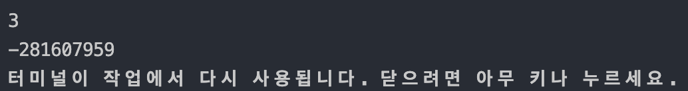
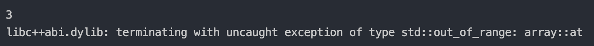

## What is STL?

STL(Standard Template Library)는 표준 C++ Library입니다.

프로그램에 필요한 자료구조와 알고리즘을 Template로 제공해줍니다.

이 포스트에서 설명할 array Template는 STL에 Sequence Container(시퀀스 컨테이너)중 하나의 요소입니다.

STL Sequence Container에는 vector, array, deque, list, forward_list가 있습니다.

STL Container에 관한 더 자세한 설명은 [이 링크](https://docs.microsoft.com/ko-kr/cpp/standard-library/stl-containers?view=vs-2019)를 통해 볼 수 있습니다.


## Why STL Array?

[앞선 포스트](https://mintyu.github.io/cpp09.md/)에서 설명했듯, 이미 C++에는 C 스타일의 static array를 지원하고 있었습니다.

하지만, 이 static array는 꽤나 사용하기 불편했습니다.

불편한 이유는 다른 언어들을 조금만 둘러보아도 알 수 있습니다.

대부분의 언어들은 배열을 선언할 때 배열에 대한 다양한 부가 정보들(length 등)을 사용할 수 있게 설계되어 있습니다.

하지만, 기존의 static array는 단순히 연속된 메모리 공간의 앞부분을 가르키는 포인터에 불과 했었기 때문에 복잡한 과정을 통해 배열의 길이를 구해야만 했습니다.

물론 vector가 있었긴 하지만, 성능 저하의 부담이 크고 잠재적인 문제가 존재했기 때문에 더 효율적인 array가 필요했습니다.

그렇게 STL Sequence Container에 array가 추가되었습니다.

이렇게 array는 vector보다 더 가볍고 빠르며 일부 STL 컨테이너를 사용할 수 있게 되었습니다.

## array Class

array를 사용하기 위해서는 우선 `#include <array>`로 array 헤더파일을 불러와야 합니다.

그리고 array를 선언하기 위한 문법은 다음과 같습니다.

> 문법
> ``` cpp
> array<타입, 크기> 배열 이름; 
> // 선언 먼저 하는 경우
> 
> array<타입, 크기> 배열 이름 = {원소1, 원소2, 원소3, ...};
> // 선언과 동시에 초기화하는 경우
> ```

주의할 점은, 이 배열의 원형은 `std::array`이므로 직접 `std::`를 입력하거나 `using namespace std;`를 이용해야합니다.

해당 포스트에서는 `using namespace std;`를 입력했다고 가정한 후 설명하겠습니다.

> 예제
> ``` cpp
> array<int, 4> arr1 = {0, 1, 2, 3};
>
> array<int, 4> arr2 = {0, 1, 2};
> // exactly same with {0, 1 ,2, 0}
> 
> array<int, 4> arr3 = {0, 1, 2, 3, 4};
> // not allowed
> 
> array<int, > arr4 = {0, 1, 2, 3};
> // not allowed
> ```

`arr1`과 같이 선언이 가능하며, `arr2`처럼 주어진 크기보다 적은 개수의 원소로 초기화해주었을 때, 부족한 만큼은 0으로 초기화됩니다.

`arr3`과 같이 주어진 크기보다 많은 수의 원소는 대입할 수 없습니다.

또한, [static array](https://mintyu.github.io/cpp09.md/)와는 다르게 `arr4`처럼 크기를 입력하지 않으면 오류가 발생합니다.

### index 접근(at)

이 array도 일반 static array처럼 `[ ]`를 통해 접근이 가능합니다.

> ``` cpp
> array<int, 4> arr1 = {0, 1, 2, 3};
> 
> cout << array[1]; // 1
> 
> array[2] = 4;
> cout << array[2]; // 4
> ```

하지만, 이 문법의 문제는 유효 범위 검사를 하지 않는다는 점입니다.

아래의 간단한 예제를 보도록 합시다.

> 예제
> ``` cpp
> #include <iostream>
> 
> using namespace std;
> 
> int main()
> {
> 	int a;
> 	cin >> a;
> 	int arr[3]= {1, 2, 3};
> 	cout << arr[a];
> 	return 0;
> }
> ```

별 문제없이 잘 실행됩니다. 하지만 a에 입력값으로 3 이상의 수를 준다면?



갑자기 이상한 값을 출력합니다.

그 원인은 index가 범위를 벗어난 것을 검사하지 않고, 초기화되지 않은 메모리에 접근했기 때문입니다.

이런 경우 프로그램이 커졌을 때, 오류를 따로 발생시키지 않게 되면 디버깅 작업이 상당히 까다로워집니다.

따라서, 유효 범위를 검사해서 따로 예외를 발생시켜주는 `at( )`을 사용하여 접근하는 것이 더 안전합니다.

물론, 유효 범위 검사를 진행하기 때문에 operator `[ ]`로 접근하는 것보다는 속도가 약간 느립니다.

`at( )`은 다음과 같이 쓸 수 있습니다.

> 예제
> ``` cpp
> #include <iostream>
> #include <array>
> 
> using namespace std;
> 
> int main()
> {
> 	int a;
> 	cin >> a;
> 	array<int, 3> arr = {1, 2, 3};
> 	cout << arr.at(a);
> 	return 0;
> }
> ```

앞서 operator로 접근한 예제와 같은 예제이지만, a에 3이상의 수를 입력하게 된다면?



이처럼 at이 out\_of\_range 예외를 발생시켰습니다.

이와 같은 접근 방식은 조금 더 안전한 코드를 만들 수 있습니다.

### 배열의 길이(size)

배열의 길이를 출력하는 방법은 다음과 같습니다.

> 문법
> ``` cpp
> 배열이름.size();
> ```

static array보다 훨씬 간단한 방법으로 배열의 길이를 출력할 수 있습니다.

### 배열 정렬(sort)

사실 정렬은 std::array에서 정의된 함수는 아니지만, 유용하게 사용할 수 있기 때문에 사용법을 알아두는것이 좋습니다.

`sort( )`는 `#include <algorithm>`을 통해 헤더파일을 불러와야 사용할 수 있습니다.

기본적으로 오름차순으로 정렬하게 됩니다.

> 문법
> ``` cpp
> sort(배열의 첫번째를 가르키는 반복자, 배열의 마지막을 가르키는 반복자);
> ```

sort 함수는 다음과 같이 사용할 수 있습니다.

> 예제
> ``` cpp
> #include <iostream>
> #include <array>
> #include <algorithm>
> 
> using namespace std;
> 
> int main()
> {
> 	array<int, 5> arr = {7, 8, 1, 2, 3};
> 	sort(arr.begin(), arr.end()); // sort arr
> 	for (int i = 0; i < 5; i++)
> 	{
> 		cout << arr[i] << " "; // 1 2 3 7 8
> 	}
> 	
> 	return 0;
> }
> ```

`sort( )`의 인자로 준 값들은 반복자(iterator)를 의미합니다.

이 예제에서는 배열의 정렬 시작과 끝 지점을 나타내는 용도로 사용되었습니다.

`begin( )`과 `end( )`는 각각 배열의 첫 번째 반복자와 마지막 반복자를 리턴하는 기능이라는 것까지만 알아두어도 좋습니다.

이 포스트에서는 "array의 정렬이 가능하다!" 까지만 이해해도 충분합니다.

반복자(iterator)와 `sort( )`에 대한 설명은 다음에 더 자세히 하도록 하겠습니다.