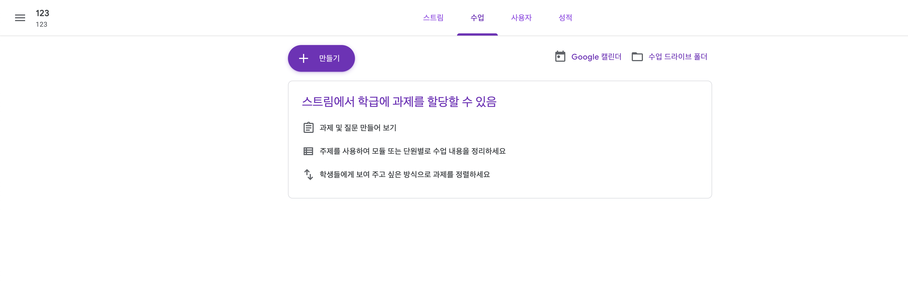
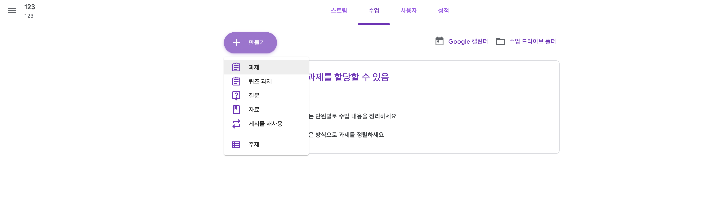
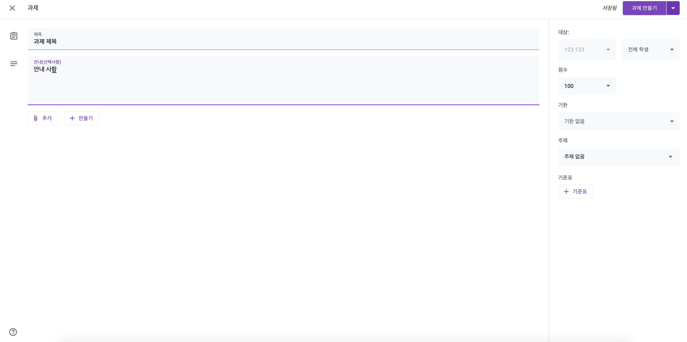
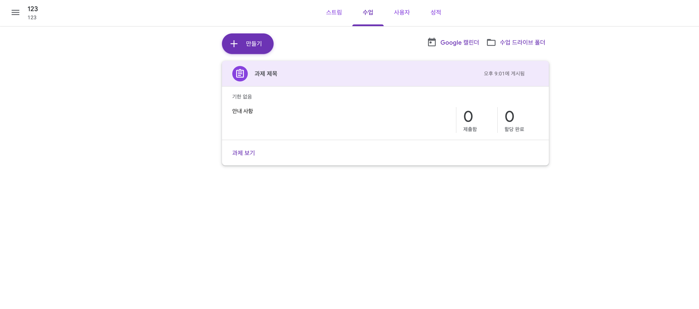

## Google Class 과제 할당

Google Class 강의실에서 과제를 할당하는 방법입니다.

123이라는 제목의 수업을 임의로 만들었습니다.

왼쪽 중단에 표시되는 과제 부분에 과제가 없다고 표시되고 있습니다.

그럼 이 수업을 듣는 학생들에게 과제를 할당해봅시다!

위쪽 탭에서 스트림 옆의 '수업' 탭을 클릭합니다.

그럼 아래와 같은 화면으로 넘어가게 됩니다.

이 화면에서, 색칠이 되어있는 '만들기' 버튼을 클릭하면 아래와 같이 과제를 만들 수 있습니다.

'과제'를 누르면 다음 화면으로 넘어갈 수 있습니다. 

과제를 설정하는 화면입니다.

과제 제목과 안내사항(선택사항)을 입력할 수 있습니다.

우측에는 과제의 기한을 설정할 수 있습니다.

설정이 완료되었다면 우측 상단에 과제 만들기 버튼을 클릭하면 과제 할당이 완료됩니다.

성공적으로 과제가 할당되었습니다! 이 화면에서는 학생들이 과제가 성공적으로 제출되었는지를 확인할 수 있습니다.